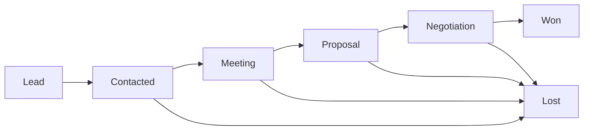
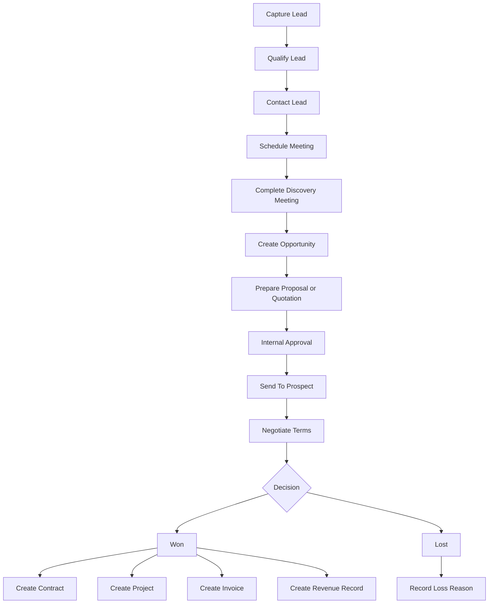
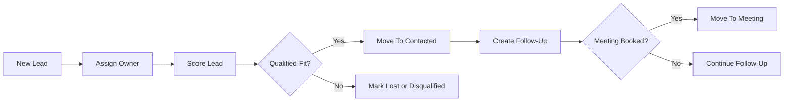
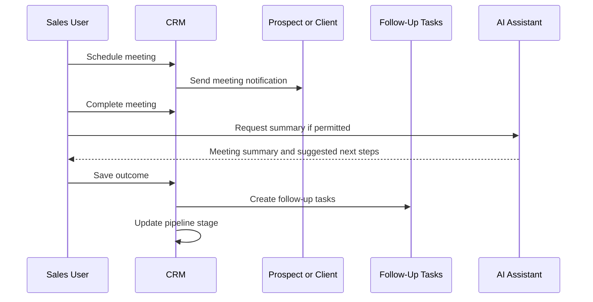
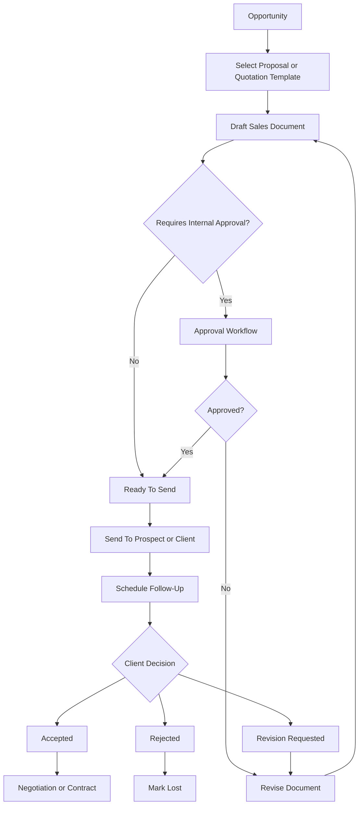
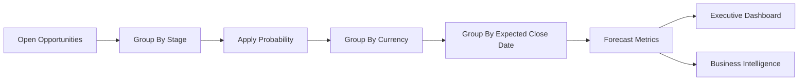
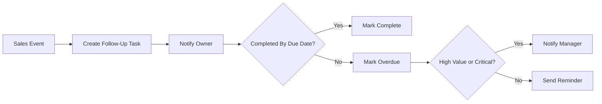

# Marketing Agency Operating System (MAOS)

## Phase 4 CRM & Sales System Specification

**Version:** 1.0  
**Phase:** Phase 4  
**Status:** CRM & Sales Specification  
**Parent Documents:** `MAOS_MASTER_SPECIFICATION_v1.1.md`, `MAOS_ENTERPRISE_ARCHITECTURE_PHASE_1.md`, `MAOS_ENTERPRISE_DATABASE_PHASE_2.md`, `MAOS_SECURITY_PERMISSIONS_PHASE_3.md`  
**Document Role:** Complete CRM and sales system specification for MAOS using the approved architecture, database, and security model  
**Code Policy:** No application code, SQL, migrations, or implementation snippets are included in this document. Mermaid blocks are diagrams only.

---

## 1. CRM & Sales Objectives

The MAOS CRM & Sales System manages the complete sales lifecycle from lead capture to closed revenue. It must support agency sales teams, account managers, owners, and authorized employees while preserving tenant isolation, role permissions, auditability, localization, currency handling, and timezone handling.

Primary objectives:

- Capture and qualify leads.
- Convert leads into opportunities.
- Schedule and track meetings.
- Manage follow-ups.
- Generate proposals.
- Generate quotations.
- Track negotiation progress.
- Convert won opportunities into clients, contracts, projects, invoices, and revenue records.
- Record lost opportunities with structured reasons.
- Forecast revenue by stage, probability, client, owner, currency, and expected close date.

---

## 2. Approved Foundation

Phase 4 uses the approved platform foundation:

| Foundation | Approved Source |
| --- | --- |
| SaaS and tenant architecture | Phase 1 Enterprise Architecture |
| Database foundation | Phase 2 Enterprise Database Specification |
| Security and permissions | Phase 3 Security & Permissions Specification |
| Master platform scope | Master Specification Version 1.1 |

### 2.1 Required Database Alignment

Phase 4 primarily uses:

- `clients`
- `client_contacts`
- `leads`
- `opportunities`
- `meetings`
- `meeting_participants`
- `contracts`
- `projects`
- `tasks`
- `files`
- `templates`
- `approvals`
- `revenue_records`
- `invoices`
- `activity_logs`
- `audit_logs`
- `notifications`

### 2.2 Proposal And Quotation Data Mapping

Phase 2 does not define dedicated `proposals` or `quotations` tables. Phase 4 therefore defines proposals and quotations as CRM sales document resources that can be represented through approved platform objects:

| Sales Object | Approved Foundation Mapping |
| --- | --- |
| Proposal template | `templates`, `template_versions` |
| Proposal document | `files` linked to opportunity/client |
| Proposal review | `approvals` |
| Proposal activity | `activity_logs` |
| Proposal audit | `audit_logs` |
| Quotation template | `templates`, `template_versions` |
| Quotation document | `files` linked to opportunity/client |
| Quotation approval | `approvals` |
| Accepted quotation | `contracts`, `invoices`, or `revenue_records` depending on workflow |

A future database revision may add dedicated proposal and quotation tables if advanced lifecycle reporting requires structured document-level fields beyond the Phase 2 model.

---

## 3. Sales Pipeline

The approved Phase 4 pipeline is:

1. Lead.
2. Contacted.
3. Meeting.
4. Proposal.
5. Negotiation.
6. Won.
7. Lost.

### 3.1 Pipeline Stage Definitions

| Stage | Meaning | Primary Record | Exit Condition |
| --- | --- | --- | --- |
| Lead | New prospect captured but not yet contacted | Lead | Contact attempt completed |
| Contacted | Sales team has contacted the lead | Lead | Meeting scheduled or disqualified/lost |
| Meeting | Discovery or sales meeting is scheduled or completed | Lead, Meeting, Opportunity | Qualified opportunity created |
| Proposal | Proposal or quotation is prepared/sent | Opportunity, File, Approval | Client enters negotiation or rejects |
| Negotiation | Commercial terms are being discussed | Opportunity | Won or lost decision |
| Won | Deal accepted | Opportunity, Client, Contract, Project, Revenue | Conversion completed |
| Lost | Deal rejected or disqualified | Lead or Opportunity | Loss reason recorded |

### 3.2 Pipeline Diagram

---

## 4. Core CRM & Sales Modules

### 4.1 Leads

Purpose: Capture and qualify potential customers before opportunity creation.

Required capabilities:

- Manual lead creation.
- Lead import.
- Lead source tracking.
- Lead owner assignment.
- Lead scoring.
- Qualification notes.
- Contact attempts.
- Follow-up scheduling.
- Conversion to opportunity.
- Conversion to client where appropriate.
- Loss or disqualification tracking.

Lead required data:

| Data | Purpose |
| --- | --- |
| Lead name | Identifies the prospect |
| Company name | Business context |
| Email and phone | Contact channels |
| Source | Attribution and campaign tracking |
| Status/stage | Pipeline position |
| Owner | Sales accountability |
| Score | Qualification priority |
| Expected value | Early revenue estimate |
| Expected close date | Forecasting input |
| Notes | Qualification details |

### 4.2 Opportunities

Purpose: Track qualified sales deals.

Required capabilities:

- Create from qualified lead.
- Create directly for existing client.
- Assign owner.
- Set stage.
- Set expected deal value.
- Set probability.
- Set expected close date.
- Link meetings.
- Link proposals and quotations.
- Track negotiation notes.
- Mark won or lost.
- Feed revenue forecast.

Opportunity required data:

| Data | Purpose |
| --- | --- |
| Opportunity name | Deal label |
| Client or lead | Business context |
| Owner | Sales accountability |
| Stage | Pipeline position |
| Amount | Forecast value |
| Currency | Financial reporting |
| Probability | Weighted forecast |
| Expected close date | Forecast period |
| Won/lost timestamp | Lifecycle tracking |
| Loss reason | Sales analysis |

### 4.3 Meetings

Purpose: Track discovery, sales, proposal, and negotiation meetings.

Required capabilities:

- Schedule meeting.
- Link to lead, opportunity, client, or project.
- Add participants.
- Record timezone.
- Record location or meeting URL.
- Capture meeting outcome.
- Create follow-up tasks.
- Attach files.
- Generate AI meeting summary where permitted.
- Convert meeting outcome into opportunity stage movement.

Meeting types:

- Discovery.
- Qualification.
- Proposal review.
- Negotiation.
- Onboarding handoff.
- Internal sales review.

### 4.4 Follow Ups

Purpose: Ensure sales actions are not missed.

Follow-ups are implemented as task and notification workflows linked to leads, opportunities, meetings, proposals, quotations, or clients.

Required capabilities:

- Create follow-up after contact attempt.
- Create follow-up after meeting.
- Create follow-up after proposal sent.
- Create follow-up before expected close date.
- Assign owner.
- Set due date and timezone.
- Trigger notification reminders.
- Mark completed.
- Escalate overdue follow-ups.

Follow-up outcomes:

- No response.
- Replied.
- Meeting booked.
- Proposal requested.
- Negotiation started.
- Won.
- Lost.

### 4.5 Proposals

Purpose: Present solution, scope, pricing direction, deliverables, and terms to a prospect or client.

Required capabilities:

- Create proposal from opportunity.
- Use proposal template.
- Attach files and scope details.
- Link quotation where needed.
- Internal approval before sending.
- Send to client or prospect.
- Track sent, viewed, accepted, rejected, and expired states where available.
- Create follow-up after sending.
- Convert accepted proposal into contract, project, invoice, and revenue records.

Proposal statuses:

- Draft.
- Internal Review.
- Approved.
- Sent.
- Viewed.
- Accepted.
- Rejected.
- Expired.
- Cancelled.

### 4.6 Quotations

Purpose: Provide structured pricing for services, retainers, campaigns, or project packages.

Required capabilities:

- Create quotation from opportunity.
- Use quotation template.
- Include line items, quantities, pricing, currency, discounts, and tax assumptions.
- Link quotation document to files.
- Request internal approval when required.
- Send quotation.
- Track accepted, rejected, expired, or revised states.
- Convert accepted quotation into invoice, contract, project, or revenue record.

Quotation statuses:

- Draft.
- Internal Review.
- Approved.
- Sent.
- Accepted.
- Rejected.
- Revised.
- Expired.
- Cancelled.

### 4.7 Revenue Forecasting

Purpose: Estimate future revenue from leads and opportunities.

Required capabilities:

- Forecast by opportunity amount.
- Forecast by pipeline stage.
- Apply probability weighting.
- Forecast by owner.
- Forecast by client.
- Forecast by currency.
- Forecast by expected close date.
- Forecast by month/quarter/year.
- Separate gross pipeline from weighted pipeline.
- Track won, lost, and slipped opportunities.
- Feed executive dashboards and BI.

Forecast formulas:

| Metric | Formula |
| --- | --- |
| Gross pipeline | Sum of opportunity amounts |
| Weighted pipeline | Opportunity amount multiplied by probability |
| Stage forecast | Sum of weighted opportunities in stage |
| Expected revenue period | Weighted opportunities grouped by expected close date |
| Win rate | Won opportunities divided by won plus lost opportunities |

---

## 5. CRM & Sales Workflow Diagrams

### 5.1 Lead To Revenue Workflow

### 5.2 Lead Qualification Workflow

### 5.3 Meeting Workflow

### 5.4 Proposal And Quotation Workflow

### 5.5 Revenue Forecasting Workflow

---

## 6. Pipeline Stage Rules

### 6.1 Stage Entry And Exit Criteria

| Stage | Entry Criteria | Exit Criteria |
| --- | --- | --- |
| Lead | Lead created from source | Lead contacted, disqualified, or lost |
| Contacted | First outreach completed | Meeting booked or lead lost |
| Meeting | Meeting scheduled or completed | Opportunity created, proposal requested, or lost |
| Proposal | Proposal or quotation is being prepared/sent | Negotiation, accepted, rejected, or expired |
| Negotiation | Terms are actively discussed | Won or lost |
| Won | Prospect accepted commercial terms | Contract/project/invoice/revenue setup completed |
| Lost | Prospect rejected or disqualified | Loss reason recorded |

### 6.2 Default Stage Probabilities

| Stage | Default Probability |
| --- | --- |
| Lead | 5% |
| Contacted | 10% |
| Meeting | 25% |
| Proposal | 50% |
| Negotiation | 75% |
| Won | 100% |
| Lost | 0% |

Tenant admins may customize probabilities if granted CRM settings permission.

### 6.3 Required Stage Validation

Rules:

- Moving to Meeting requires a meeting record or scheduled meeting date.
- Moving to Proposal requires an opportunity.
- Moving to Negotiation requires a sent proposal or quotation, unless manually overridden by authorized Manager or Owner.
- Moving to Won requires accepted commercial terms.
- Moving to Lost requires loss reason.
- Moving to Won should create or update revenue records.

---

## 7. Follow-Up System

### 7.1 Follow-Up Triggers

Follow-ups must be created or suggested when:

- Lead is created.
- Lead is contacted.
- Prospect does not respond.
- Meeting is completed.
- Proposal is sent.
- Quotation is sent.
- Negotiation is inactive.
- Expected close date is approaching.
- Opportunity slips past expected close date.

### 7.2 Follow-Up Rules

Rules:

- Follow-up must have owner.
- Follow-up must have due date.
- Follow-up must be linked to lead, opportunity, meeting, proposal, quotation, or client.
- Overdue follow-ups must notify owner.
- High-value overdue follow-ups may notify Manager.
- Completed follow-ups should create activity log entries.

### 7.3 Follow-Up Diagram

---

## 8. Proposals And Quotations

### 8.1 Proposal Requirements

Proposal must include:

- Client or prospect.
- Opportunity.
- Proposal owner.
- Scope summary.
- Deliverables.
- Timeline assumptions.
- Pricing summary or linked quotation.
- Terms and assumptions.
- Expiry date where applicable.
- Internal approval status.
- File attachment or generated document.

### 8.2 Quotation Requirements

Quotation must include:

- Client or prospect.
- Opportunity.
- Currency.
- Line items.
- Quantity.
- Unit price.
- Discount if applicable.
- Tax assumptions if applicable.
- Total amount.
- Expiry date.
- Approval status.
- File attachment or generated document.

### 8.3 Proposal And Quotation Approval Rules

Approval is required when:

- Discount exceeds tenant threshold.
- Deal amount exceeds tenant threshold.
- Margin is below tenant threshold.
- Contract terms are non-standard.
- Payment terms are non-standard.
- Employee or delivery capacity risk is detected.
- AI-generated proposal is client-facing and requires review.

---

## 9. Revenue Forecasting

### 9.1 Forecast Inputs

Forecasting uses:

- Opportunity amount.
- Currency.
- Stage.
- Probability.
- Expected close date.
- Owner.
- Client.
- Lead source.
- Proposal status.
- Quotation status.
- Historical win/loss rate where available.

### 9.2 Forecast Views

Required views:

- Gross pipeline by stage.
- Weighted pipeline by stage.
- Forecast by month.
- Forecast by quarter.
- Forecast by owner.
- Forecast by client.
- Forecast by currency.
- Forecast by lead source.
- Won revenue.
- Lost revenue.
- Slipped opportunities.

### 9.3 Forecast Controls

Rules:

- Won opportunities count as 100%.
- Lost opportunities count as 0%.
- Open opportunities use stage probability unless manually overridden.
- Currency conversion must preserve source currency.
- Forecast date ranges must state timezone.
- Forecast changes must be traceable through activity or audit logs where material.

---

## 10. CRM & Sales Permissions

### 10.1 Role Access

| Capability | Owner | Manager | Employee | Client |
| --- | --- | --- | --- | --- |
| View CRM dashboard | Full | Full/assigned | Limited assigned | None |
| Create leads | Yes | Yes | If granted | No |
| Assign leads | Yes | Yes | No | No |
| Convert leads | Yes | Yes | If granted | No |
| Manage opportunities | Yes | Yes | Assigned only | No |
| Schedule meetings | Yes | Yes | Assigned only | Client-visible invited only |
| Create follow-ups | Yes | Yes | Assigned only | No |
| Create proposals | Yes | Yes | If granted | No |
| Create quotations | Yes | Yes | If granted | No |
| Send proposals | Yes | Yes | If granted | No |
| Approve proposals | Yes | If granted | No | No |
| Mark won/lost | Yes | Yes | If granted | No |
| View revenue forecast | Yes | Yes | Limited if granted | No |
| Export sales data | Yes | If granted | No | No |

### 10.2 Required Permissions

Recommended permission keys:

- `crm.read`
- `crm.manage`
- `leads.create`
- `leads.update`
- `leads.assign`
- `leads.convert`
- `opportunities.create`
- `opportunities.update`
- `opportunities.assign`
- `meetings.create`
- `meetings.update`
- `followups.manage`
- `proposals.create`
- `proposals.send`
- `proposals.approve`
- `quotations.create`
- `quotations.send`
- `quotations.approve`
- `sales.mark_won`
- `sales.mark_lost`
- `sales.forecast.read`
- `sales.export`

---

## 11. Notifications And Automations

### 11.1 CRM Notifications

Required notifications:

- New lead assigned.
- Lead overdue for contact.
- Meeting scheduled.
- Meeting reminder.
- Meeting completed without follow-up.
- Proposal approval requested.
- Proposal sent.
- Quotation sent.
- Proposal viewed where tracking is available.
- Follow-up overdue.
- Opportunity expected close date approaching.
- High-value opportunity moved to negotiation.
- Opportunity won.
- Opportunity lost.

### 11.2 Sales Automations

Recommended automations:

- Create follow-up when lead is assigned.
- Create follow-up after meeting completion.
- Create follow-up after proposal sent.
- Notify Manager when high-value opportunity is inactive.
- Notify Owner when high-value opportunity is won.
- Move opportunity to Lost after defined inactivity period only with human confirmation.
- Update revenue forecast when opportunity amount, stage, probability, or close date changes.

---

## 12. AI In CRM & Sales

### 12.1 AI Capabilities

AI may assist with:

- Lead summary.
- Lead qualification suggestion.
- Meeting summary.
- Follow-up suggestions.
- Proposal draft.
- Quotation explanation.
- Negotiation risk summary.
- Loss reason clustering.
- Revenue forecast explanation.
- Sales pipeline executive summary.

### 12.2 AI Safety Rules

Rules:

- AI must follow the user's CRM and sales permissions.
- AI cannot access other tenants.
- AI cannot expose internal notes to clients.
- AI-generated proposals and quotations require review before sending.
- AI cannot mark opportunity as won or lost without user confirmation.
- AI cannot send external sales documents without permission and confirmation.
- AI actions must be logged in `ai_logs`.
- Sensitive AI-assisted actions must be logged in `audit_logs`.

---

## 13. Reporting And Dashboards

### 13.1 CRM Dashboard

Required metrics:

- New leads.
- Leads by source.
- Leads by owner.
- Contacted leads.
- Meetings booked.
- Open opportunities.
- Opportunity value.
- Pipeline by stage.
- Proposal count.
- Quotation count.
- Won deals.
- Lost deals.
- Win rate.

### 13.2 Sales Forecast Dashboard

Required metrics:

- Gross pipeline.
- Weighted pipeline.
- Forecast by month.
- Forecast by quarter.
- Forecast by owner.
- Forecast by client.
- Forecast by currency.
- Slipped opportunities.
- High-risk opportunities.
- Expected close date distribution.

### 13.3 Sales Activity Dashboard

Required metrics:

- Follow-ups due.
- Follow-ups overdue.
- Meetings completed.
- Proposals sent.
- Quotations sent.
- Average time from lead to meeting.
- Average time from proposal to decision.
- Average deal size.

---

## 14. Audit And Activity Logging

### 14.1 Activity Logs

Activity logs should be created for:

- Lead created.
- Lead assigned.
- Lead stage changed.
- Meeting scheduled.
- Meeting completed.
- Follow-up created.
- Follow-up completed.
- Proposal created.
- Proposal sent.
- Quotation created.
- Quotation sent.
- Opportunity stage changed.
- Opportunity amount changed.
- Opportunity probability changed.
- Opportunity won.
- Opportunity lost.

### 14.2 Audit Logs

Audit logs are required for:

- Sales data export.
- Deleting or archiving leads/opportunities.
- Sending client-facing proposal.
- Sending quotation.
- Approving proposal or quotation.
- Marking high-value opportunity as lost.
- Marking opportunity as won.
- Changing expected revenue above threshold.
- Changing custom stage probability.
- AI-generated sales document sent externally.

---

## 15. Acceptance Criteria

Phase 4 is accepted when:

- The CRM and sales pipeline stages are defined as Lead, Contacted, Meeting, Proposal, Negotiation, Won, Lost.
- Leads are fully specified from capture to conversion or loss.
- Opportunities are fully specified from qualification to won/lost.
- Meetings are fully specified and linked to sales progression.
- Follow-up workflows are defined.
- Proposals are defined with review, sending, acceptance, rejection, and conversion rules.
- Quotations are defined with pricing, review, sending, acceptance, rejection, and conversion rules.
- Revenue forecasting is defined with gross and weighted pipeline logic.
- Workflows and diagrams are included.
- Role access and permissions are defined.
- Notifications, automations, AI assistance, activity logs, and audit logs are defined.
- No implementation code is included.

---

## 16. Final Phase 4 Statement

This Phase 4 CRM & Sales System Specification defines the complete sales operating model for MAOS. It governs lead capture, opportunity management, meetings, follow-ups, proposals, quotations, negotiation, won/lost conversion, revenue forecasting, sales reporting, permissions, notifications, automations, AI support, and auditability.

All CRM and sales implementation must preserve tenant isolation, invite-only access, role-based permissions, client data boundaries, auditability, currency handling, timezone handling, and the approved Phase 1 to Phase 3 foundations.

