# Marketing Agency Operating System (MAOS)

## Phase 1 Enterprise Architecture

**Version:** 1.0  
**Phase:** Phase 1  
**Status:** Architecture Foundation  
**Parent Document:** `MAOS_MASTER_SPECIFICATION_v1.0.md`  
**Document Role:** Enterprise architecture blueprint for SaaS, multi-tenancy, white-labeling, AI, security, notifications, files, billing, sandbox, staging, and production environments  
**Code Policy:** No application code is included in this document. Diagrams are provided as architecture diagrams.

---

## 1. Architecture Objectives

Phase 1 establishes the enterprise architecture foundation for MAOS. The architecture must support a secure, scalable, invite-only, multi-tenant SaaS platform for marketing agencies with white-label client portals and AI-enabled operations.

Primary objectives:

- Define the platform architecture before implementation begins.
- Establish strict tenant isolation and permission boundaries.
- Support agency white-label branding and custom domains.
- Separate sandbox, staging, and production environments.
- Define deployment, security, notification, file, billing, and AI architectures.
- Ensure future modules can be added without redesigning the core platform.

---

## 2. Enterprise Architecture Overview

MAOS is structured as a modular SaaS platform with shared core services and domain modules. Each request is resolved through tenant context, identity, permissions, environment, and feature availability before reaching business modules.

### 2.1 High-Level Platform Diagram

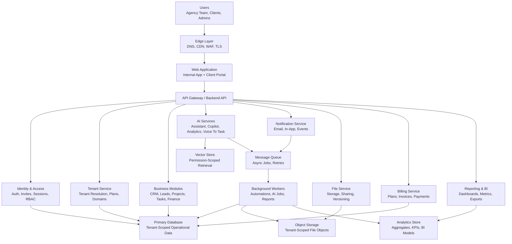

### 2.2 Architectural Style

Phase 1 uses a modular monolith or service-oriented modular backend as the preferred starting point, with clear boundaries between modules. This reduces early operational complexity while preserving the ability to extract services later.

Recommended style:

- Single deployable application for core product workflows in the first phase.
- Clear internal domain modules.
- Shared identity, tenant, audit, notification, file, and billing services.
- Background worker layer for asynchronous work.
- Integration boundaries for AI, payments, email, storage, and analytics.
- Event-driven patterns for notifications, automations, reporting, and AI jobs.

---

## 3. Multi Tenant Architecture

### 3.1 Multi-Tenant Model

Each agency is represented as a tenant. Tenant context is mandatory for every tenant-owned record, request, background job, file, notification, AI interaction, report, and billing event.

Default Phase 1 model:

- Shared application runtime.
- Shared operational database.
- Tenant-scoped records using `tenant_id`.
- Tenant-scoped file paths or object metadata.
- Tenant-scoped AI retrieval.
- Tenant-scoped analytics.
- Tenant-scoped billing plans and entitlements.

Future enterprise option:

- Dedicated database per enterprise tenant.
- Dedicated storage bucket per enterprise tenant.
- Dedicated encryption keys per enterprise tenant.
- Dedicated deployment region where required.

### 3.2 Tenant Resolution Flow

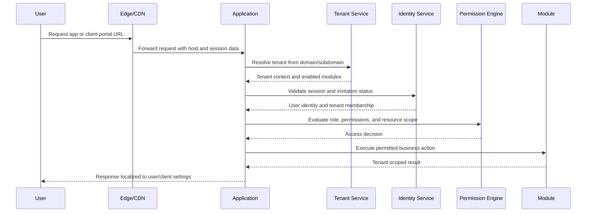

### 3.3 Tenant Isolation Rules

Required rules:

- Every tenant-owned table must include tenant scope.
- API queries must enforce tenant filters by default.
- Background jobs must include tenant context.
- File objects must be mapped to tenant and access policy metadata.
- AI retrieval must only index and retrieve documents available to the requesting user.
- Reports and dashboards must aggregate only authorized tenant data.
- Cross-tenant operations are restricted to platform super-admin functions and must be audited.

### 3.4 Tenant Lifecycle

Tenant states:

- Provisioning.
- Active.
- Suspended.
- Pending Cancellation.
- Archived.
- Deleted.

Tenant lifecycle capabilities:

- Create tenant from platform admin action only.
- Configure agency branding.
- Configure default language, currency, and timezone.
- Invite agency owner.
- Enable modules based on subscription.
- Suspend access for billing, abuse, or administrative reasons.
- Export data where authorized.
- Archive or delete according to retention policy.

---

## 4. SaaS Architecture

### 4.1 SaaS Layering

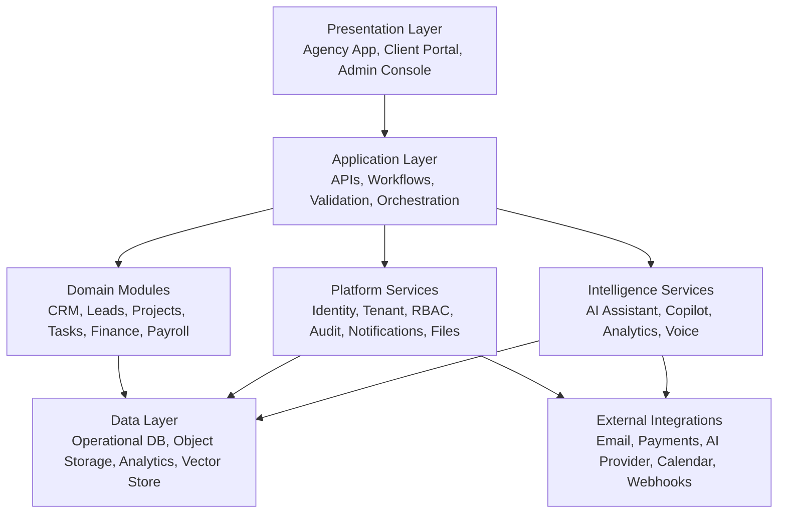

### 4.2 Core SaaS Services

Core services:

- Tenant service.
- Identity service.
- Invitation service.
- RBAC/permission service.
- Audit service.
- Feature entitlement service.
- Notification service.
- File service.
- Billing service.
- Reporting service.
- AI orchestration service.
- Automation service.

### 4.3 Feature Entitlement Model

Feature access is controlled by tenant plan, module enablement, role permissions, and environment.

Entitlement dimensions:

- Plan tier.
- Enabled modules.
- User role.
- Tenant status.
- White-label configuration.
- AI limits.
- File storage limits.
- Automation limits.
- Client portal access.
- Payment feature availability.

### 4.4 SaaS Operating Requirements

The SaaS platform must support:

- Centralized deployment.
- Tenant-aware configuration.
- Runtime feature flags.
- Environment-specific secrets.
- Audit and compliance reporting.
- Plan-based limits.
- Tenant-level data export.
- Operational monitoring.

---

## 5. White Label Architecture

### 5.1 White Label Scope

White labeling applies to the agency-facing and client-facing experience where permitted. The architecture must support tenant-specific branding without creating separate application builds for each agency.

White-label areas:

- Custom domain.
- Login page branding.
- Client portal branding.
- App navigation branding.
- Email templates.
- Invoice templates.
- PDF reports.
- Notification sender identity.
- Theme colors.
- Logo and favicon.

### 5.2 White Label Diagram

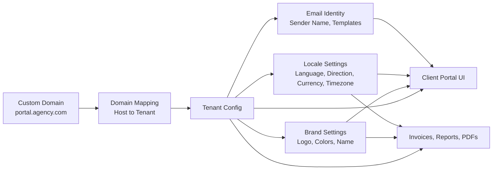

### 5.3 Custom Domain Flow

Custom domain setup:

1. Agency admin enters custom domain.
2. Platform generates DNS verification record.
3. Agency adds DNS record.
4. Platform verifies ownership.
5. TLS certificate is provisioned.
6. Domain maps to tenant.
7. Requests from the domain resolve tenant context before rendering.

### 5.4 White Label Configuration Model

Tenant brand configuration includes:

- Logo asset ID.
- Favicon asset ID.
- Primary color.
- Secondary color.
- Accent color.
- Portal display name.
- Email sender name.
- Reply-to email.
- Invoice footer.
- Report footer.
- Default language.
- Default direction.

### 5.5 White Label Guardrails

Required guardrails:

- Platform-required legal and security notices cannot be removed where legally required.
- Custom domains must be verified before use.
- Email sending domains must be verified before branded sender use.
- Tenant theme settings must pass accessibility contrast checks where feasible.
- Uploaded brand assets must follow file security rules.

---

## 6. Deployment Architecture

### 6.1 Deployment Model

MAOS should use a controlled multi-environment deployment model:

- Sandbox for experiments, demos, and tenant-safe testing.
- Staging for release validation.
- Production for live customer operations.

Each environment must have separate:

- Application deployment.
- Database.
- Object storage.
- Secrets.
- Email configuration.
- Payment configuration.
- AI provider configuration.
- Logging and monitoring labels.

### 6.2 Deployment Diagram

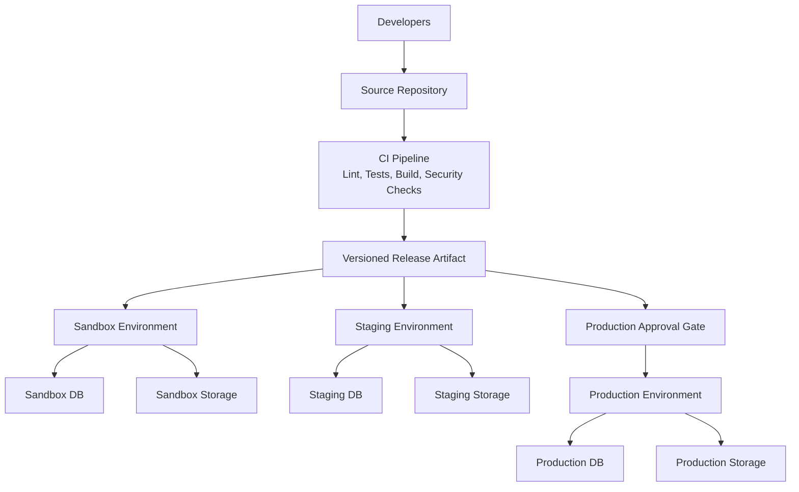

### 6.3 Release Strategy

Recommended Phase 1 release strategy:

- Build once, promote the same artifact across environments.
- Use environment variables and secrets for environment-specific behavior.
- Use feature flags for controlled rollout.
- Require staging validation before production release.
- Maintain rollback strategy for production.
- Run database migrations through an approved migration process.

### 6.4 Infrastructure Components

Required components:

- DNS.
- CDN.
- Web application runtime.
- API runtime.
- Background worker runtime.
- Primary database.
- Object storage.
- Queue.
- Cache.
- Email provider integration.
- Payment provider integration.
- AI provider integration.
- Monitoring and logging.
- Secrets manager.

---

## 7. AI Architecture

### 7.1 AI Architecture Goals

AI in MAOS must be permission-aware, tenant-aware, auditable, and action-safe. AI features must assist users without bypassing business rules, access rules, or approval workflows.

AI capabilities:

- AI Assistant.
- AI Copilot.
- AI Analytics.
- Voice To Task.
- Summarization.
- Translation.
- Task generation.
- Risk detection.
- Report drafting.

### 7.2 AI System Diagram

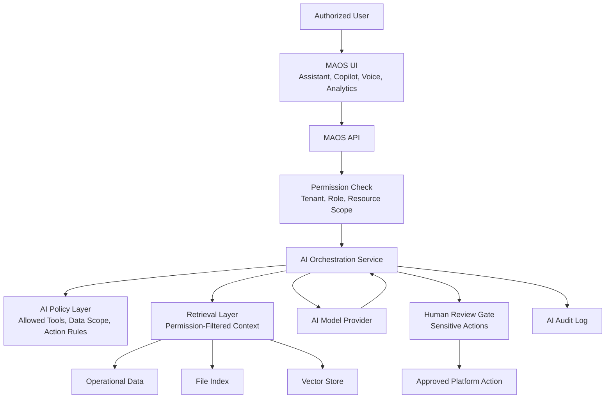

### 7.3 AI Permission Rules

AI must follow the same access model as the requesting user.

Rules:

- AI cannot retrieve data the user cannot access.
- AI cannot expose internal notes to client users unless shared.
- AI cannot create, update, send, approve, delete, or bill without permitted action scope.
- AI-generated suggestions must be distinguishable from human actions.
- Sensitive actions require explicit confirmation.
- AI interactions must be logged with tenant, user, timestamp, feature, action type, and data scope.

### 7.4 AI Data Flow

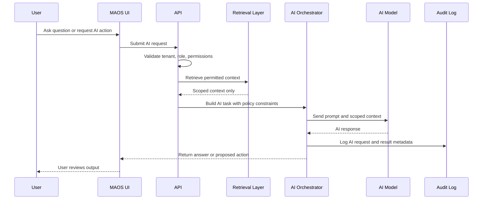

### 7.5 Voice To Task Architecture

Voice To Task flow:

- User records or uploads voice input.
- File is stored temporarily under tenant context.
- Speech service transcribes audio.
- AI extracts task structure.
- User reviews extracted task.
- Task is created only after confirmation.
- Source and transcript metadata are stored according to policy.

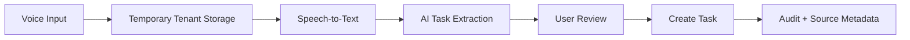

### 7.6 AI Analytics Architecture

AI Analytics uses aggregated operational data, not unrestricted raw access.

Sources:

- CRM pipeline metrics.
- Project status and task progress.
- Finance and invoice metrics.
- Team workload and timesheets.
- Client health indicators.
- Historical trends.

Outputs:

- Risk insights.
- Recommended actions.
- Executive summaries.
- Trend explanations.
- Forecast indicators.

---

## 8. Security Architecture

### 8.1 Security Principles

Security principles:

- Deny by default.
- Tenant isolation by design.
- Invite-only access.
- Least privilege.
- Audit important actions.
- Encrypt data in transit.
- Protect sensitive data at rest.
- Separate secrets by environment.
- Require confirmation for sensitive AI and automation actions.

### 8.2 Security Layers

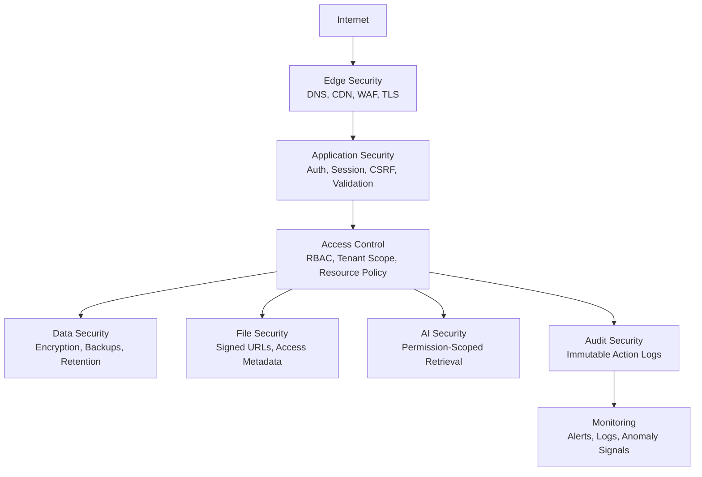

### 8.3 Identity Security

Required:

- Invite-only onboarding.
- Expiring invitation links.
- Secure password reset or passwordless authentication.
- Session expiration.
- Login rate limiting.
- Optional MFA.
- Future SSO/SAML/OIDC support.

### 8.4 Authorization Security

Authorization must evaluate:

- Tenant membership.
- Role.
- Fine-grained permission.
- Resource ownership.
- Client visibility.
- Module entitlement.
- Environment.
- Action sensitivity.

### 8.5 Data Security

Required:

- HTTPS for all traffic.
- Encrypted storage where supported.
- Database backups.
- Restore testing.
- Soft delete for critical business records.
- Retention policies.
- Audit trail for sensitive changes.
- Separate production data from non-production environments.

### 8.6 Security Event Logging

Security events:

- Login success/failure.
- Invitation creation, acceptance, revocation.
- Role changes.
- Permission changes.
- Billing admin changes.
- Payroll access.
- Payment events.
- File sharing changes.
- AI sensitive action attempts.
- Automation failures.
- Suspicious access attempts.

---

## 9. Notification Architecture

### 9.1 Notification Goals

Notifications must deliver relevant, tenant-branded, permission-aware updates across in-app and email channels.

Supported channels:

- In-app notifications.
- Email notifications.
- Future push notifications.
- Future webhook notifications.

### 9.2 Notification Diagram

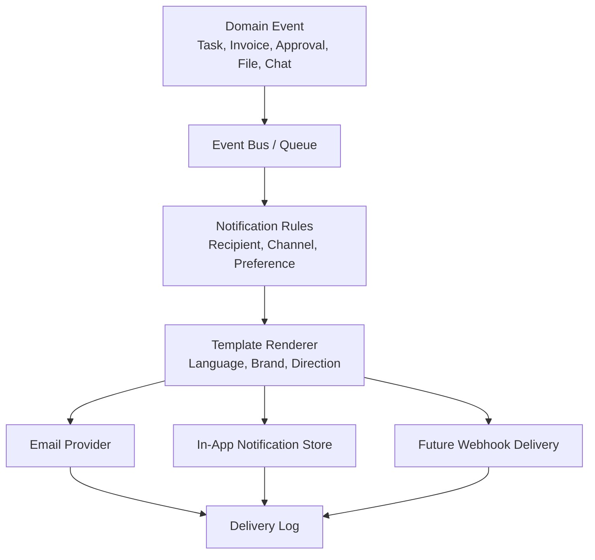

### 9.3 Notification Event Types

Required event families:

- Invitation events.
- Task events.
- Project events.
- Approval events.
- Chat mention events.
- File sharing events.
- Invoice events.
- Payment events.
- Report events.
- Automation events.
- Security events.

### 9.4 Notification Rules

Each notification must resolve:

- Tenant.
- Recipient user.
- Recipient role.
- Client visibility.
- Language.
- Text direction.
- Timezone.
- Brand template.
- Delivery channel.
- Notification preference.

### 9.5 Notification Reliability

Required:

- Queue-based delivery.
- Retry on temporary failure.
- Dead-letter handling for repeated failure.
- Delivery logs.
- User preference respect.
- Suppression for unauthorized recipients.
- No sensitive data in email subject lines where avoidable.

---

## 10. File Architecture

### 10.1 File Architecture Goals

The file architecture must support secure tenant-scoped storage, client sharing, versioning, previews, approvals, reports, and AI indexing where permitted.

### 10.2 File System Diagram

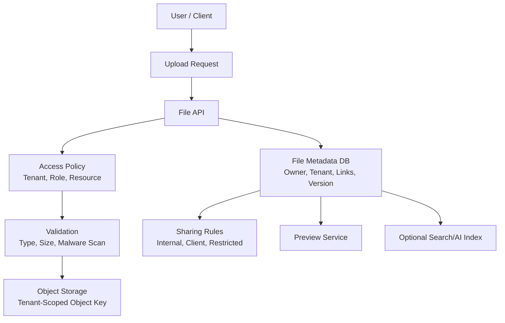

### 10.3 File Metadata

Required metadata:

- File ID.
- Tenant ID.
- Owner user ID.
- Client ID where applicable.
- Project ID where applicable.
- Task ID where applicable.
- Approval ID where applicable.
- Storage object key.
- File name.
- MIME type.
- Size.
- Version number.
- Visibility.
- Access policy.
- Created at.
- Updated at.
- Deleted at.

### 10.4 File Access Rules

Required:

- Files are private by default.
- Client-shared files must have explicit visibility.
- Signed URLs should expire.
- File downloads must be audited for sensitive files.
- Version history must preserve previous deliverables where required.
- Deleted files follow retention policy before permanent deletion.

### 10.5 File And AI Interaction

AI can only index or summarize files when:

- The tenant permits AI features.
- The file type is supported.
- The requesting user has access.
- The file visibility allows AI retrieval.
- Sensitive file restrictions are respected.

---

## 11. Billing Architecture

### 11.1 Billing Scope

Billing covers MAOS subscription plans, tenant entitlements, invoices, payments, and plan-based limits. It is separate from agency-client invoicing, although both may share financial concepts.

### 11.2 Billing Domains

Billing architecture includes:

- Tenant subscription.
- Plan and package configuration.
- Module entitlements.
- Usage limits.
- Subscription invoice.
- Payment provider integration.
- Billing status.
- Trial or sandbox status where applicable.

### 11.3 Billing Diagram

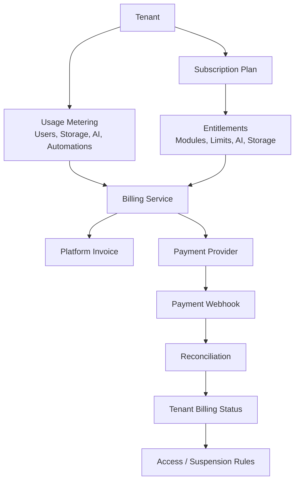

### 11.4 Billing Statuses

Tenant billing statuses:

- Active.
- Trial.
- Past Due.
- Payment Failed.
- Suspended.
- Cancelled.

### 11.5 Billing Security

Required:

- No raw card storage.
- Payment provider handles card data.
- Webhooks must be verified.
- Payment events must be idempotent.
- Billing admin actions must be audited.
- Billing failures must not expose sensitive payment details to unauthorized users.

---

## 12. Sandbox Architecture

### 12.1 Sandbox Purpose

Sandbox exists for demos, experiments, training, safe testing, and integration trials without affecting production data.

### 12.2 Sandbox Rules

Required:

- Separate database.
- Separate object storage.
- Separate secrets.
- Separate payment test configuration.
- Separate email configuration with safe delivery controls.
- Synthetic or anonymized data only.
- AI provider settings may use reduced limits.
- No production customer data unless anonymized and explicitly approved.

### 12.3 Sandbox Diagram

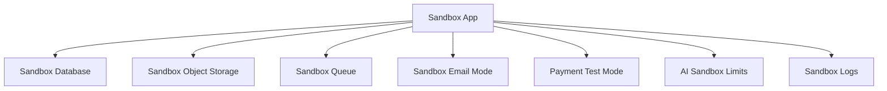

### 12.4 Sandbox Use Cases

Use cases:

- Product demos.
- Internal QA experiments.
- AI prompt testing.
- Automation testing.
- Payment test flows.
- White-label theme testing.
- Client portal demonstrations.

---

## 13. Staging Architecture

### 13.1 Staging Purpose

Staging validates production-ready releases before deployment to production.

### 13.2 Staging Rules

Required:

- Mirrors production architecture as closely as reasonable.
- Uses separate staging database.
- Uses separate staging storage.
- Uses test payment credentials.
- Uses controlled email delivery.
- Uses staging AI settings.
- Runs release validation tests.
- Requires approval before production promotion.

### 13.3 Staging Diagram

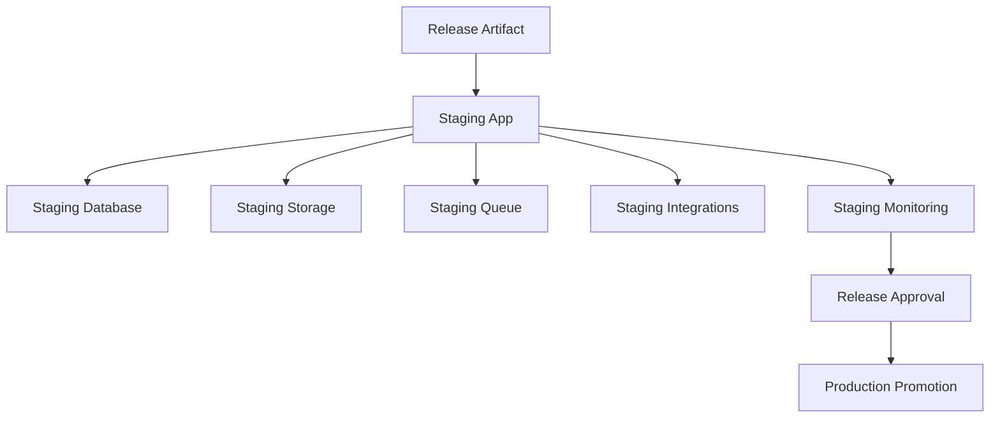

### 13.4 Staging Validation Checklist

Required checks:

- Authentication.
- Invitation flow.
- Tenant resolution.
- RBAC.
- White-label rendering.
- CRM, leads, projects, tasks.
- File upload/download.
- Approval workflow.
- Notification rendering.
- Billing test flow.
- AI permission scope.
- Database migrations.
- Background jobs.
- Error logging.

---

## 14. Production Architecture

### 14.1 Production Purpose

Production is the live environment for real agency tenants and client users. It requires the strongest security, monitoring, backup, and operational controls.

### 14.2 Production Diagram

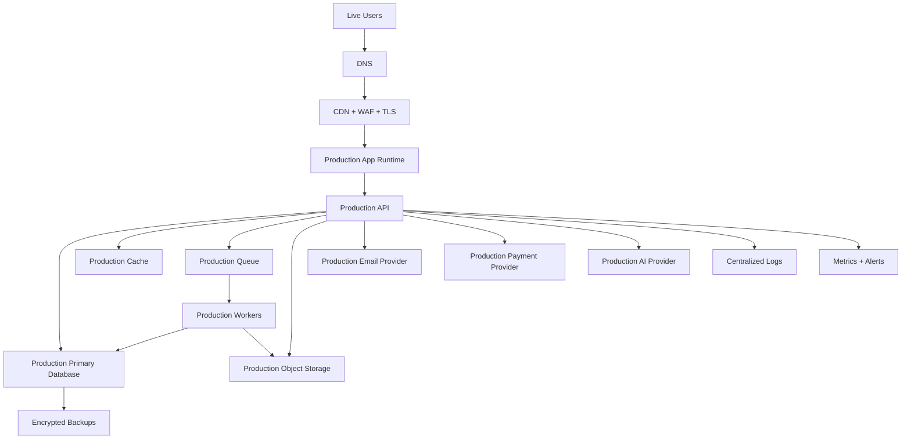

### 14.3 Production Requirements

Required:

- Strong environment isolation.
- Production-only secrets.
- WAF and TLS.
- Monitoring and alerting.
- Error tracking.
- Database backups.
- Restore procedure.
- Queue monitoring.
- Payment webhook monitoring.
- AI usage monitoring.
- Audit logs.
- Incident response process.

### 14.4 Production Release Controls

Required:

- Staging approval before production deployment.
- Migration review for database changes.
- Rollback plan.
- Deployment logs.
- Release notes.
- Post-deployment smoke tests.
- Monitoring after release.

---

## 15. Environment Separation

### 15.1 Environment Matrix

| Area | Sandbox | Staging | Production |
| --- | --- | --- | --- |
| Purpose | Experiments and demos | Release validation | Live customer operations |
| Data | Synthetic/anonymized | Test or sanitized | Real customer data |
| Payments | Test mode | Test mode | Live mode |
| Email | Suppressed or allowlisted | Allowlisted | Live sending |
| AI | Limited/test | Staging policy | Production policy |
| Storage | Sandbox bucket | Staging bucket | Production bucket |
| Access | Internal/admin | Internal QA/admin | Authorized live users |
| Monitoring | Basic | Release-focused | Full alerts and incident response |

### 15.2 Data Movement Rules

Allowed:

- Code moves from repository to environments.
- Release artifacts promote from staging to production.
- Sanitized production-like data may move to staging only with approval.

Not allowed:

- Production database copied into sandbox without anonymization.
- Sandbox data promoted to production.
- Production secrets used in sandbox or staging.
- Live payment credentials used outside production.

---

## 16. Cross-Cutting Architecture Concerns

### 16.1 Audit Architecture

Audit logging is mandatory for:

- Authentication.
- Invitations.
- Permissions.
- Client records.
- Financial records.
- Payroll.
- File sharing.
- AI actions.
- Automations.
- Billing changes.

Audit logs must include:

- Tenant ID.
- Actor ID.
- Actor type.
- Action.
- Resource type.
- Resource ID.
- Timestamp.
- Source IP or session metadata where appropriate.
- Result.

### 16.2 Observability Architecture

Required observability:

- Application logs.
- API request metrics.
- Error tracking.
- Job queue metrics.
- Database performance metrics.
- AI usage metrics.
- Payment webhook metrics.
- Email delivery metrics.
- Security event alerts.

### 16.3 Backup And Recovery

Required:

- Automated production database backups.
- Object storage retention.
- Backup encryption.
- Restore testing.
- Recovery point objective defined before launch.
- Recovery time objective defined before launch.

### 16.4 Configuration Architecture

Configuration layers:

- Environment configuration.
- Tenant configuration.
- User preferences.
- Feature flags.
- Plan entitlements.
- White-label settings.

Configuration priority:

1. Security and platform policy.
2. Environment restrictions.
3. Tenant entitlements.
4. Tenant configuration.
5. User preferences.

---

## 17. Recommended Phase 1 Delivery Order

Phase 1 architecture should be implemented in this order:

1. Environment separation: sandbox, staging, production.
2. Tenant model and tenant resolution.
3. Invite-only identity and RBAC.
4. Core SaaS module shell.
5. White-label tenant settings.
6. File architecture foundation.
7. Notification event foundation.
8. Billing entitlement foundation.
9. Security, audit, and observability.
10. AI orchestration foundation.

---

## 18. Architecture Acceptance Criteria

Phase 1 architecture is accepted when:

- Multi-tenant boundaries are defined and enforceable.
- SaaS services and module boundaries are clear.
- White-label branding and domain resolution are defined.
- Sandbox, staging, and production are separated.
- Deployment promotion flow is defined.
- AI architecture respects permissions and audit requirements.
- Security layers are documented.
- Notification delivery flow is defined.
- File storage, metadata, and access rules are defined.
- Billing, entitlements, and payment safety are defined.
- Production readiness requirements are clear.

---

## 19. Final Architecture Statement

This Phase 1 Enterprise Architecture establishes the technical foundation for MAOS as a secure, scalable, invite-only, multi-tenant SaaS platform with white-label client portals, AI-enabled workflows, strong environment separation, and production-grade operational controls.

All future implementation, module design, infrastructure setup, database design, and deployment planning must align with this architecture unless superseded by an approved later architecture version.

