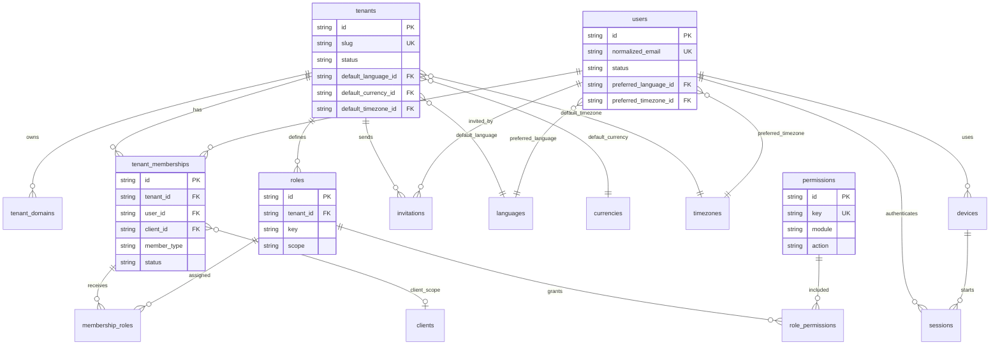
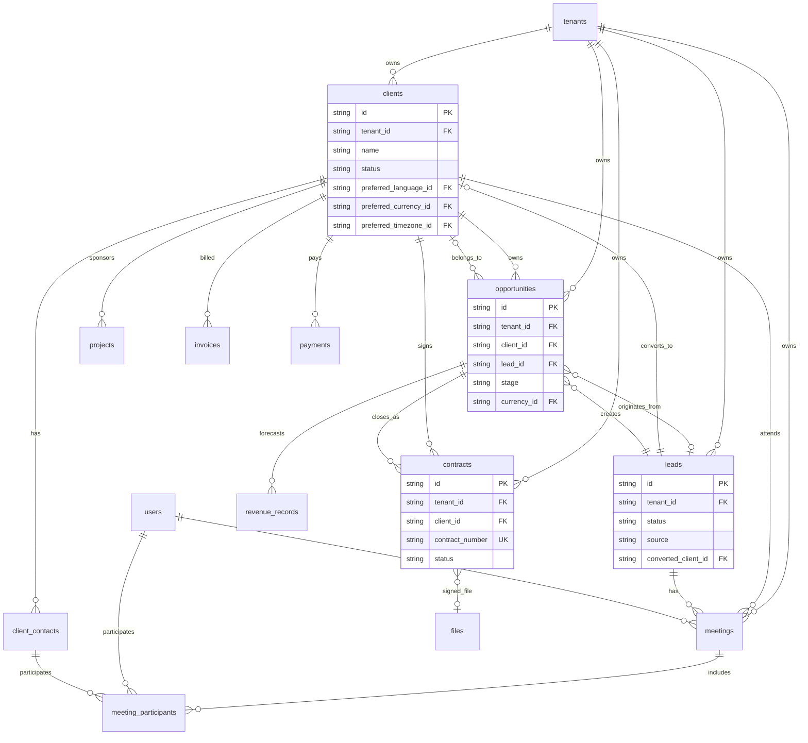
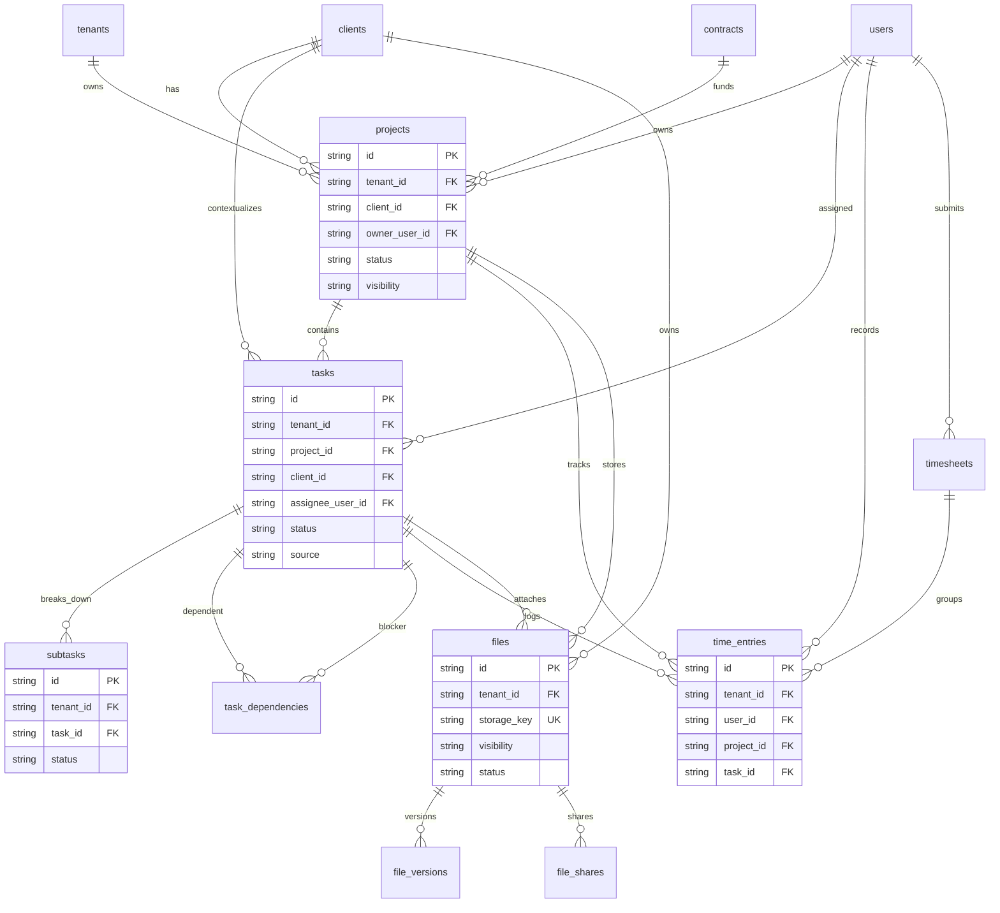
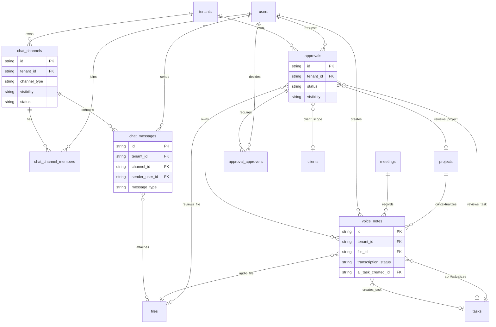
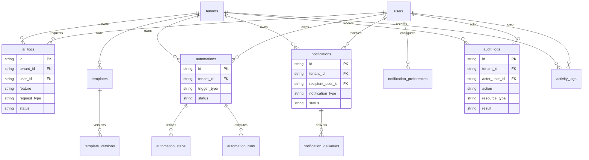
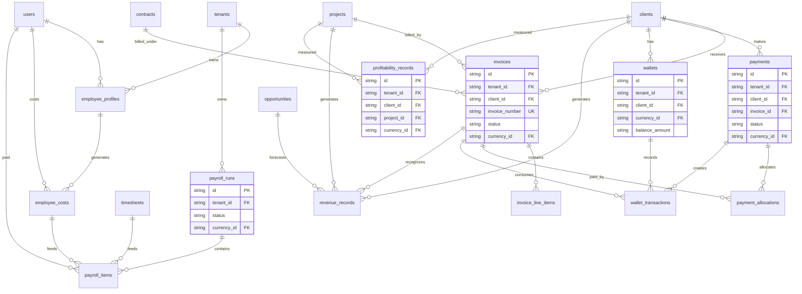

# Marketing Agency Operating System (MAOS)

## Phase 2 Enterprise Database Specification

**Version:** 1.1  
**Phase:** Phase 2  
**Status:** Approved Database Specification  
**Parent Documents:** `MAOS_MASTER_SPECIFICATION_v1.1.md`, `MAOS_ENTERPRISE_ARCHITECTURE_PHASE_1.md`  
**Document Role:** Complete enterprise logical database specification for MAOS using the approved Phase 1 Enterprise Architecture  
**Code Policy:** No SQL, migrations, ORM definitions, or application code are included in this document. Mermaid ERD blocks are diagrams only.

---

## 1. Database Design Objectives

The MAOS enterprise database must support a secure, scalable, invite-only, multi-tenant SaaS platform for marketing agencies. It must serve agency operations, client portals, billing, finance, AI, automations, chat, files, reporting, auditability, and localization.

Primary objectives:

- Enforce tenant isolation.
- Support invite-only identity and access control.
- Model agency operations from lead to revenue.
- Support client-facing and internal workflows.
- Track finance, payroll, profitability, payments, wallets, and invoices.
- Preserve audit, activity, AI, session, and device history.
- Support Arabic RTL, English LTR, German LTR, EUR, USD, AED, SAR, user timezones, and client timezones.
- Provide clear fields, relations, constraints, and indexes for implementation.

### 1.1 Module Coverage

This document covers the complete Phase 2 enterprise database design for:

- CRM.
- Leads.
- Clients.
- Projects.
- Tasks.
- Subtasks.
- Files.
- Chat.
- Voice Notes.
- AI.
- Payroll.
- Finance.
- Invoices.
- Payments.
- Contracts.
- Notifications.
- Audit Logs.

---

## 2. Global Database Standards

### 2.1 Identifier Standard

All primary business records should use globally unique identifiers.

Recommended identifier fields:

| Field | Applies To | Notes |
| --- | --- | --- |
| `id` | All primary tables | Stable unique record identifier |
| `tenant_id` | All tenant-owned tables | Required for tenant isolation |
| `public_id` | External-facing records | Optional friendly identifier for invoices, tasks, projects |

### 2.2 Common Tenant-Owned Fields

Unless explicitly stated otherwise, tenant-owned tables should include:

| Field | Required | Notes |
| --- | --- | --- |
| `id` | Yes | Primary identifier |
| `tenant_id` | Yes | References tenant |
| `created_at` | Yes | Stored in UTC |
| `created_by_user_id` | Conditional | Null allowed for system-created records |
| `updated_at` | Yes | Stored in UTC |
| `updated_by_user_id` | Conditional | Null allowed for system updates |
| `deleted_at` | No | Soft delete timestamp where applicable |
| `status` | Conditional | Required for workflow entities |
| `metadata` | No | Structured extensibility field for non-critical provider data |

### 2.3 Multi-Tenant Rules

- Every tenant-owned record must include `tenant_id`.
- Child records must belong to the same tenant as their parent.
- Cross-tenant foreign keys are not allowed except controlled platform administration references.
- Client portal users may only access records linked to their client membership.
- Soft-deleted records must be excluded from normal application queries.

### 2.4 Deletion Rules

Recommended deletion model:

- Business records: soft delete.
- Audit logs: append-only, no normal deletion.
- Activity logs: append-only with retention policy.
- Sessions: expire and revoke, then retain according to security policy.
- Files: soft delete metadata first, physical deletion after retention period.
- Payments and invoices: void/refund/status changes instead of destructive deletion.

### 2.5 Money Rules

All money values must store:

- Amount in minor units where implementation supports it.
- Currency code.
- Exchange rate where converted reporting is required.
- Source amount and source currency for auditability.

Supported currencies:

- EUR.
- USD.
- AED.
- SAR.

### 2.6 Time Rules

- Store timestamps in UTC.
- Store timezone identifiers for scheduled business events.
- Display using user timezone or client timezone depending on context.
- Date-range reports must store or display the timezone used.

### 2.7 Enterprise ERD Diagrams

The ERD diagrams below show the approved logical relationships. Detailed fields, constraints, and indexes are defined in the table sections that follow.

#### 2.7.1 Core Multi-Tenant, Identity, Access, And Localization ERD

#### 2.7.2 CRM, Leads, Clients, Opportunities, Meetings, And Contracts ERD

#### 2.7.3 Projects, Tasks, Subtasks, Time Tracking, And Files ERD

#### 2.7.4 Collaboration, Chat, Voice Notes, And Approvals ERD

#### 2.7.5 AI, Templates, Automations, Notifications, And Audit ERD

#### 2.7.6 Payroll, Finance, Invoices, Payments, Wallets, And Profitability ERD

---

## 3. Core Platform Tables

### 3.1 `tenants`

Purpose: Represents each agency workspace.

| Field | Required | Notes |
| --- | --- | --- |
| `id` | Yes | Primary tenant identifier |
| `name` | Yes | Agency display name |
| `legal_name` | No | Legal entity name |
| `slug` | Yes | Unique workspace slug |
| `status` | Yes | provisioning, active, suspended, archived, deleted |
| `default_language_id` | Yes | References languages |
| `default_currency_id` | Yes | References currencies |
| `default_timezone_id` | Yes | References timezones |
| `billing_email` | No | Tenant billing contact email |
| `support_email` | No | Tenant support email |
| `logo_file_id` | No | References files |
| `favicon_file_id` | No | References files |
| `primary_color` | No | White-label color |
| `secondary_color` | No | White-label color |
| `accent_color` | No | White-label color |
| `created_at` | Yes | UTC |
| `updated_at` | Yes | UTC |

Relations:

- One tenant has many users through tenant memberships.
- One tenant has many clients, leads, projects, invoices, files, and logs.
- One tenant has default language, currency, and timezone.

Constraints:

- `slug` must be globally unique.
- `status` must use approved tenant statuses.
- Default language, currency, and timezone must reference active lookup values.

Indexes:

- Unique index on `slug`.
- Index on `status`.
- Index on `default_language_id`.
- Index on `default_currency_id`.

### 3.2 `tenant_domains`

Purpose: Maps custom and system domains to tenants.

| Field | Required | Notes |
| --- | --- | --- |
| `id` | Yes | Primary identifier |
| `tenant_id` | Yes | References tenants |
| `domain` | Yes | Full domain |
| `type` | Yes | system, custom, client_portal |
| `verification_status` | Yes | pending, verified, failed, revoked |
| `tls_status` | Yes | pending, active, failed |
| `verified_at` | No | UTC |
| `created_at` | Yes | UTC |
| `updated_at` | Yes | UTC |

Relations:

- Many domains belong to one tenant.

Constraints:

- Domain must be globally unique.
- Custom domain cannot be active until verified.

Indexes:

- Unique index on `domain`.
- Index on `tenant_id`.
- Index on `verification_status`.

---

## 4. Localization Reference Tables

### 4.1 `languages`

Purpose: Supported interface and communication languages.

| Field | Required | Notes |
| --- | --- | --- |
| `id` | Yes | Primary identifier |
| `code` | Yes | ar, en, de |
| `name` | Yes | Arabic, English, German |
| `native_name` | Yes | Native language label |
| `direction` | Yes | rtl or ltr |
| `is_active` | Yes | Availability flag |

Relations:

- Referenced by users, clients, tenants, templates, and notifications.

Constraints:

- `code` must be unique.
- Direction must be rtl or ltr.

Indexes:

- Unique index on `code`.
- Index on `is_active`.

### 4.2 `currencies`

Purpose: Supported financial currencies.

| Field | Required | Notes |
| --- | --- | --- |
| `id` | Yes | Primary identifier |
| `code` | Yes | EUR, USD, AED, SAR |
| `name` | Yes | Currency name |
| `symbol` | Yes | Display symbol |
| `minor_unit` | Yes | Decimal precision |
| `is_active` | Yes | Availability flag |

Relations:

- Referenced by tenants, clients, invoices, payments, wallets, revenue, payroll, and costs.

Constraints:

- `code` must be unique.
- Only approved currencies are active in Phase 2.

Indexes:

- Unique index on `code`.
- Index on `is_active`.

### 4.3 `timezones`

Purpose: Supported timezone catalog.

| Field | Required | Notes |
| --- | --- | --- |
| `id` | Yes | Primary identifier |
| `iana_name` | Yes | IANA timezone name |
| `display_name` | Yes | User-facing label |
| `utc_offset_current` | No | Display optimization only |
| `is_active` | Yes | Availability flag |

Relations:

- Referenced by users, clients, tenants, meetings, tasks, automations, and reports.

Constraints:

- `iana_name` must be unique.
- Stored timestamps remain UTC regardless of timezone.

Indexes:

- Unique index on `iana_name`.
- Index on `is_active`.

---

## 5. Identity And Access Tables

### 5.1 `users`

Purpose: Global user identity record.

| Field | Required | Notes |
| --- | --- | --- |
| `id` | Yes | Primary user identifier |
| `email` | Yes | Login email |
| `normalized_email` | Yes | Lowercase normalized email |
| `full_name` | Yes | Display name |
| `avatar_file_id` | No | References files |
| `preferred_language_id` | Yes | References languages |
| `preferred_timezone_id` | Yes | References timezones |
| `status` | Yes | invited, active, suspended, disabled |
| `last_login_at` | No | UTC |
| `email_verified_at` | No | UTC |
| `created_at` | Yes | UTC |
| `updated_at` | Yes | UTC |

Relations:

- One user can belong to many tenants through tenant memberships.
- One user can have many sessions and devices.
- One user can create records, comments, tasks, approvals, and logs.

Constraints:

- `normalized_email` must be globally unique.
- User status must use approved values.

Indexes:

- Unique index on `normalized_email`.
- Index on `status`.
- Index on `preferred_language_id`.

### 5.2 `tenant_memberships`

Purpose: Connects users to tenants and defines workspace membership.

| Field | Required | Notes |
| --- | --- | --- |
| `id` | Yes | Primary identifier |
| `tenant_id` | Yes | References tenants |
| `user_id` | Yes | References users |
| `member_type` | Yes | agency_user, client_user, external_collaborator |
| `client_id` | Conditional | Required for client users |
| `status` | Yes | invited, active, suspended, removed |
| `joined_at` | No | UTC |
| `created_at` | Yes | UTC |
| `updated_at` | Yes | UTC |

Relations:

- Many memberships belong to one tenant.
- Many memberships belong to one user.
- Client memberships may reference one client.

Constraints:

- One active membership per user per tenant and client scope.
- Client users must have `client_id`.
- Agency users must not require `client_id`.

Indexes:

- Unique active index on `tenant_id`, `user_id`, `client_id`.
- Index on `tenant_id`, `status`.
- Index on `user_id`.
- Index on `client_id`.

### 5.3 `roles`

Purpose: Defines tenant-scoped or platform roles.

| Field | Required | Notes |
| --- | --- | --- |
| `id` | Yes | Primary identifier |
| `tenant_id` | Conditional | Null for platform/system roles |
| `name` | Yes | Role name |
| `key` | Yes | Stable role key |
| `scope` | Yes | platform, tenant, client |
| `is_system` | Yes | True for protected built-in roles |
| `description` | No | Role description |
| `created_at` | Yes | UTC |
| `updated_at` | Yes | UTC |

Relations:

- Roles have many permissions through role permissions.
- Users receive roles through membership roles.

Constraints:

- Role key must be unique within tenant and scope.
- System roles cannot be deleted.

Indexes:

- Unique index on `tenant_id`, `key`, `scope`.
- Index on `scope`.
- Index on `is_system`.

### 5.4 `permissions`

Purpose: Defines atomic access capabilities.

| Field | Required | Notes |
| --- | --- | --- |
| `id` | Yes | Primary identifier |
| `key` | Yes | Stable permission key |
| `module` | Yes | crm, projects, finance, files, ai, billing, etc. |
| `action` | Yes | read, create, update, delete, approve, export, manage |
| `description` | No | Human-readable explanation |
| `is_sensitive` | Yes | Requires stricter handling |

Relations:

- Permissions are assigned to roles through role permissions.

Constraints:

- Permission key must be globally unique.

Indexes:

- Unique index on `key`.
- Index on `module`.
- Index on `is_sensitive`.

### 5.5 `role_permissions`

Purpose: Maps roles to permissions.

| Field | Required | Notes |
| --- | --- | --- |
| `id` | Yes | Primary identifier |
| `role_id` | Yes | References roles |
| `permission_id` | Yes | References permissions |
| `created_at` | Yes | UTC |

Relations:

- Many-to-many relationship between roles and permissions.

Constraints:

- Each role-permission pair must be unique.

Indexes:

- Unique index on `role_id`, `permission_id`.
- Index on `permission_id`.

### 5.6 `membership_roles`

Purpose: Assigns roles to tenant memberships.

| Field | Required | Notes |
| --- | --- | --- |
| `id` | Yes | Primary identifier |
| `membership_id` | Yes | References tenant memberships |
| `role_id` | Yes | References roles |
| `assigned_by_user_id` | No | References users |
| `created_at` | Yes | UTC |

Relations:

- Many roles can be assigned to one membership.

Constraints:

- Role scope must match membership type and tenant.
- Each membership-role pair must be unique.

Indexes:

- Unique index on `membership_id`, `role_id`.
- Index on `role_id`.

### 5.7 `invitations`

Purpose: Invite-only onboarding for users.

| Field | Required | Notes |
| --- | --- | --- |
| `id` | Yes | Primary identifier |
| `tenant_id` | Yes | References tenants |
| `email` | Yes | Invitee email |
| `normalized_email` | Yes | Lowercase normalized email |
| `invited_by_user_id` | Yes | References users |
| `client_id` | Conditional | Required for client invitations |
| `member_type` | Yes | agency_user, client_user, external_collaborator |
| `status` | Yes | pending, accepted, expired, revoked |
| `token_hash` | Yes | Hashed invitation token |
| `expires_at` | Yes | UTC |
| `accepted_at` | No | UTC |
| `revoked_at` | No | UTC |
| `created_at` | Yes | UTC |

Relations:

- Invitation belongs to tenant.
- Invitation may create or connect a user and tenant membership.
- Invitation may reference a client.

Constraints:

- Token hash must be unique.
- Pending invitation expires at `expires_at`.
- Revoked invitation cannot be accepted.

Indexes:

- Unique index on `token_hash`.
- Index on `tenant_id`, `normalized_email`, `status`.
- Index on `expires_at`.
- Index on `client_id`.

### 5.8 `sessions`

Purpose: Tracks authenticated user sessions.

| Field | Required | Notes |
| --- | --- | --- |
| `id` | Yes | Primary identifier |
| `user_id` | Yes | References users |
| `tenant_id` | No | Last active tenant context |
| `device_id` | No | References devices |
| `session_token_hash` | Yes | Hashed session token |
| `ip_address` | No | Security metadata |
| `user_agent` | No | Browser or device metadata |
| `status` | Yes | active, expired, revoked |
| `created_at` | Yes | UTC |
| `last_seen_at` | Yes | UTC |
| `expires_at` | Yes | UTC |
| `revoked_at` | No | UTC |

Relations:

- One user has many sessions.
- Session may reference a device.

Constraints:

- Session token hash must be unique.
- Expired or revoked sessions cannot authenticate.

Indexes:

- Unique index on `session_token_hash`.
- Index on `user_id`, `status`.
- Index on `expires_at`.
- Index on `tenant_id`.

### 5.9 `devices`

Purpose: Stores known user devices for security and session management.

| Field | Required | Notes |
| --- | --- | --- |
| `id` | Yes | Primary identifier |
| `user_id` | Yes | References users |
| `device_fingerprint_hash` | Yes | Hashed device fingerprint |
| `device_name` | No | User-facing device label |
| `device_type` | No | desktop, mobile, tablet, unknown |
| `browser` | No | Browser metadata |
| `os` | No | Operating system metadata |
| `last_ip_address` | No | Security metadata |
| `last_seen_at` | No | UTC |
| `trusted_at` | No | UTC |
| `revoked_at` | No | UTC |
| `created_at` | Yes | UTC |

Relations:

- One user has many devices.
- Devices have many sessions.

Constraints:

- Device fingerprint hash must be unique per user.

Indexes:

- Unique index on `user_id`, `device_fingerprint_hash`.
- Index on `last_seen_at`.
- Index on `revoked_at`.

---

## 6. CRM, Sales, Meetings, And Contracts

### 6.1 `clients`

Purpose: Represents agency clients.

| Field | Required | Notes |
| --- | --- | --- |
| `id` | Yes | Primary identifier |
| `tenant_id` | Yes | References tenants |
| `name` | Yes | Client display name |
| `legal_name` | No | Legal billing name |
| `industry` | No | Client industry |
| `website` | No | Client website |
| `status` | Yes | prospect, active, paused, churned, archived |
| `account_owner_user_id` | No | References users |
| `preferred_language_id` | Yes | References languages |
| `preferred_currency_id` | Yes | References currencies |
| `preferred_timezone_id` | Yes | References timezones |
| `billing_email` | No | Billing contact email |
| `billing_address` | No | Structured address |
| `tax_identifier` | No | Optional tax/VAT identifier |
| `health_score` | No | Computed or manually set |
| `created_at` | Yes | UTC |
| `updated_at` | Yes | UTC |
| `deleted_at` | No | Soft delete |

Relations:

- One client has many contacts, projects, files, approvals, invoices, payments, meetings, contracts, and chat channels.
- Client can originate from a lead or opportunity.

Constraints:

- Client name should be unique per tenant where active, unless duplicates are explicitly allowed.
- Preferred language, currency, and timezone must be active lookup values.

Indexes:

- Index on `tenant_id`, `status`.
- Index on `tenant_id`, `name`.
- Index on `account_owner_user_id`.
- Index on `preferred_currency_id`.

### 6.2 `client_contacts`

Purpose: People associated with client organizations.

| Field | Required | Notes |
| --- | --- | --- |
| `id` | Yes | Primary identifier |
| `tenant_id` | Yes | References tenants |
| `client_id` | Yes | References clients |
| `full_name` | Yes | Contact name |
| `email` | No | Contact email |
| `normalized_email` | No | Lowercase normalized email |
| `phone` | No | Contact phone |
| `title` | No | Job title |
| `preferred_language_id` | No | References languages |
| `is_primary` | Yes | Primary client contact flag |
| `portal_user_id` | No | References users when portal access exists |
| `status` | Yes | active, inactive, archived |
| `created_at` | Yes | UTC |
| `updated_at` | Yes | UTC |

Relations:

- Many contacts belong to one client.
- Contact may connect to one portal user.

Constraints:

- Only one primary active contact per client should be allowed.
- Email should be unique per client when provided.

Indexes:

- Index on `tenant_id`, `client_id`.
- Index on `normalized_email`.
- Index on `portal_user_id`.

### 6.3 `leads`

Purpose: Captures potential customers before conversion.

| Field | Required | Notes |
| --- | --- | --- |
| `id` | Yes | Primary identifier |
| `tenant_id` | Yes | References tenants |
| `lead_name` | Yes | Person or company name |
| `company_name` | No | Company name |
| `email` | No | Lead email |
| `phone` | No | Lead phone |
| `source` | Yes | manual, website, email, referral, import, api, ai |
| `status` | Yes | new, contacted, qualified, proposal_sent, negotiation, won, lost, disqualified |
| `owner_user_id` | No | References users |
| `score` | No | Lead score |
| `expected_value_amount` | No | Expected value |
| `expected_value_currency_id` | No | References currencies |
| `expected_close_date` | No | Date |
| `converted_client_id` | No | References clients |
| `converted_opportunity_id` | No | References opportunities |
| `converted_at` | No | UTC |
| `created_at` | Yes | UTC |
| `updated_at` | Yes | UTC |
| `deleted_at` | No | Soft delete |

Relations:

- Lead may convert to client and opportunity.
- Lead may have activities, meetings, files, and notes.

Constraints:

- Converted leads must reference converted client or opportunity.
- Expected value requires currency.

Indexes:

- Index on `tenant_id`, `status`.
- Index on `tenant_id`, `owner_user_id`.
- Index on `tenant_id`, `source`.
- Index on `expected_close_date`.

### 6.4 `opportunities`

Purpose: Tracks sales deals and revenue opportunities.

| Field | Required | Notes |
| --- | --- | --- |
| `id` | Yes | Primary identifier |
| `tenant_id` | Yes | References tenants |
| `client_id` | No | References clients |
| `lead_id` | No | References leads |
| `name` | Yes | Opportunity name |
| `stage` | Yes | discovery, proposal, negotiation, won, lost |
| `owner_user_id` | No | References users |
| `amount` | Yes | Expected deal amount |
| `currency_id` | Yes | References currencies |
| `probability_percent` | No | 0 to 100 |
| `expected_close_date` | No | Date |
| `won_at` | No | UTC |
| `lost_at` | No | UTC |
| `loss_reason` | No | Required when lost where possible |
| `created_at` | Yes | UTC |
| `updated_at` | Yes | UTC |
| `deleted_at` | No | Soft delete |

Relations:

- Opportunity may come from a lead.
- Opportunity may belong to a client.
- Opportunity may create contracts, projects, revenue forecasts, and invoices.

Constraints:

- Opportunity must reference at least one of client or lead.
- Probability must be between 0 and 100.
- Amount requires currency.
- Won opportunities should have `won_at`.
- Lost opportunities should have `lost_at`.

Indexes:

- Index on `tenant_id`, `stage`.
- Index on `owner_user_id`.
- Index on `client_id`.
- Index on `lead_id`.
- Index on `expected_close_date`.

### 6.5 `meetings`

Purpose: Stores sales, client, project, and internal meetings.

| Field | Required | Notes |
| --- | --- | --- |
| `id` | Yes | Primary identifier |
| `tenant_id` | Yes | References tenants |
| `title` | Yes | Meeting title |
| `description` | No | Meeting description |
| `meeting_type` | Yes | sales, client, project, internal, finance |
| `client_id` | No | References clients |
| `lead_id` | No | References leads |
| `opportunity_id` | No | References opportunities |
| `project_id` | No | References projects |
| `organizer_user_id` | Yes | References users |
| `start_at` | Yes | UTC |
| `end_at` | Yes | UTC |
| `timezone_id` | Yes | References timezones |
| `location` | No | Physical or virtual location |
| `meeting_url` | No | Video meeting URL |
| `status` | Yes | scheduled, completed, cancelled, no_show |
| `summary` | No | Human or AI summary |
| `created_at` | Yes | UTC |
| `updated_at` | Yes | UTC |

Relations:

- Meeting can link to client, lead, opportunity, or project.
- Meeting has participants through meeting participants.
- Meeting may produce tasks, voice notes, files, and AI logs.

Constraints:

- End time must be after start time.
- Meeting must be linked to at least one business context or marked internal.

Indexes:

- Index on `tenant_id`, `start_at`.
- Index on `organizer_user_id`, `start_at`.
- Index on `client_id`.
- Index on `project_id`.
- Index on `status`.

### 6.6 `meeting_participants`

Purpose: Tracks internal and external meeting participants.

| Field | Required | Notes |
| --- | --- | --- |
| `id` | Yes | Primary identifier |
| `tenant_id` | Yes | References tenants |
| `meeting_id` | Yes | References meetings |
| `user_id` | No | Internal or portal user |
| `client_contact_id` | No | Client contact |
| `external_email` | No | External participant |
| `role` | Yes | organizer, attendee, optional |
| `response_status` | No | accepted, declined, tentative, none |
| `created_at` | Yes | UTC |

Relations:

- Many participants belong to one meeting.

Constraints:

- Participant must reference user, client contact, or external email.
- Duplicate participant for the same meeting should be prevented.

Indexes:

- Index on `meeting_id`.
- Index on `user_id`.
- Index on `client_contact_id`.
- Index on `external_email`.

### 6.7 `contracts`

Purpose: Tracks contracts, statements of work, retainers, and signed agreements.

| Field | Required | Notes |
| --- | --- | --- |
| `id` | Yes | Primary identifier |
| `tenant_id` | Yes | References tenants |
| `client_id` | Yes | References clients |
| `opportunity_id` | No | References opportunities |
| `project_id` | No | References projects |
| `contract_number` | Yes | Tenant-scoped identifier |
| `title` | Yes | Contract title |
| `contract_type` | Yes | retainer, project, sow, nda, other |
| `status` | Yes | draft, sent, signed, active, expired, terminated |
| `start_date` | No | Contract start date |
| `end_date` | No | Contract end date |
| `value_amount` | No | Contract value |
| `currency_id` | No | References currencies |
| `signed_at` | No | UTC |
| `file_id` | No | References files |
| `created_at` | Yes | UTC |
| `updated_at` | Yes | UTC |
| `deleted_at` | No | Soft delete |

Relations:

- Contract belongs to one client.
- Contract may link to opportunity, project, invoices, files, and approvals.

Constraints:

- Contract number must be unique per tenant.
- Contract value requires currency.
- End date must be after start date when both exist.

Indexes:

- Unique index on `tenant_id`, `contract_number`.
- Index on `client_id`.
- Index on `status`.
- Index on `opportunity_id`.
- Index on `project_id`.

---

## 7. Projects, Tasks, And Time Tracking

### 7.1 `projects`

Purpose: Manages agency delivery work.

| Field | Required | Notes |
| --- | --- | --- |
| `id` | Yes | Primary identifier |
| `tenant_id` | Yes | References tenants |
| `client_id` | Yes | References clients |
| `contract_id` | No | References contracts |
| `name` | Yes | Project name |
| `code` | No | Tenant-scoped project code |
| `description` | No | Project description |
| `owner_user_id` | Yes | References users |
| `status` | Yes | draft, active, on_hold, waiting_for_client, at_risk, completed, cancelled |
| `visibility` | Yes | internal, client_visible, restricted |
| `start_date` | No | Date |
| `due_date` | No | Date |
| `completed_at` | No | UTC |
| `budget_amount` | No | Project budget |
| `budget_currency_id` | No | References currencies |
| `health_status` | No | healthy, warning, critical |
| `created_at` | Yes | UTC |
| `updated_at` | Yes | UTC |
| `deleted_at` | No | Soft delete |

Relations:

- Project belongs to one client.
- Project has many tasks, files, approvals, time entries, revenue records, costs, invoices, and chat channels.

Constraints:

- Project code must be unique per tenant when provided.
- Budget amount requires currency.
- Due date must not be before start date when both exist.

Indexes:

- Index on `tenant_id`, `status`.
- Index on `client_id`, `status`.
- Index on `owner_user_id`.
- Index on `due_date`.
- Unique index on `tenant_id`, `code` where code exists.

### 7.2 `tasks`

Purpose: Tracks work items.

| Field | Required | Notes |
| --- | --- | --- |
| `id` | Yes | Primary identifier |
| `tenant_id` | Yes | References tenants |
| `project_id` | No | References projects |
| `client_id` | No | References clients |
| `parent_task_id` | No | References tasks for nested work |
| `title` | Yes | Task title |
| `description` | No | Task description |
| `status` | Yes | backlog, todo, in_progress, in_review, waiting_for_client, approved, done, blocked, cancelled |
| `priority` | Yes | low, normal, high, urgent |
| `assignee_user_id` | No | References users |
| `reporter_user_id` | No | References users |
| `visibility` | Yes | internal, client_visible, restricted |
| `due_at` | No | UTC |
| `timezone_id` | No | References timezones when due time has user context |
| `estimate_minutes` | No | Work estimate |
| `actual_minutes` | No | Computed from time entries |
| `source` | Yes | manual, automation, ai, voice_to_task, import |
| `created_at` | Yes | UTC |
| `updated_at` | Yes | UTC |
| `completed_at` | No | UTC |
| `deleted_at` | No | Soft delete |

Relations:

- Task may belong to project and client.
- Task has subtasks, comments, files, approvals, time entries, voice notes, and activity logs.

Constraints:

- Task must have project or client context unless explicitly internal.
- Assignee must be tenant member.
- Client-visible tasks must be linked to a client.
- Completed status should set `completed_at`.

Indexes:

- Index on `tenant_id`, `status`.
- Index on `project_id`, `status`.
- Index on `assignee_user_id`, `status`.
- Index on `due_at`.
- Index on `client_id`.
- Index on `source`.

### 7.3 `subtasks`

Purpose: Lightweight child checklist items or structured subwork.

| Field | Required | Notes |
| --- | --- | --- |
| `id` | Yes | Primary identifier |
| `tenant_id` | Yes | References tenants |
| `task_id` | Yes | References tasks |
| `title` | Yes | Subtask title |
| `description` | No | Optional details |
| `status` | Yes | todo, in_progress, done, cancelled |
| `assignee_user_id` | No | References users |
| `sort_order` | Yes | Display ordering |
| `due_at` | No | UTC |
| `created_at` | Yes | UTC |
| `updated_at` | Yes | UTC |
| `completed_at` | No | UTC |

Relations:

- Many subtasks belong to one task.

Constraints:

- Subtask tenant must match parent task tenant.
- Sort order should be unique within task when strict ordering is required.

Indexes:

- Index on `task_id`, `sort_order`.
- Index on `assignee_user_id`, `status`.
- Index on `due_at`.

### 7.4 `task_dependencies`

Purpose: Defines blocked-by or depends-on relationships between tasks.

| Field | Required | Notes |
| --- | --- | --- |
| `id` | Yes | Primary identifier |
| `tenant_id` | Yes | References tenants |
| `task_id` | Yes | Dependent task |
| `depends_on_task_id` | Yes | Blocking task |
| `dependency_type` | Yes | blocks, relates_to, duplicates |
| `created_at` | Yes | UTC |

Relations:

- Many-to-many relationship between tasks.

Constraints:

- Task cannot depend on itself.
- Both tasks must belong to same tenant.
- Duplicate dependency pair is not allowed.

Indexes:

- Unique index on `task_id`, `depends_on_task_id`, `dependency_type`.
- Index on `depends_on_task_id`.

### 7.5 `time_entries`

Purpose: Tracks work time for tasks, projects, clients, payroll, and profitability.

| Field | Required | Notes |
| --- | --- | --- |
| `id` | Yes | Primary identifier |
| `tenant_id` | Yes | References tenants |
| `user_id` | Yes | References users |
| `client_id` | No | References clients |
| `project_id` | No | References projects |
| `task_id` | No | References tasks |
| `description` | No | Work description |
| `start_at` | Yes | UTC |
| `end_at` | No | UTC, null while running |
| `duration_minutes` | No | Computed or stored duration |
| `timezone_id` | Yes | User timezone at entry |
| `billable` | Yes | Billable flag |
| `approved` | Yes | Approval state |
| `approved_by_user_id` | No | References users |
| `approved_at` | No | UTC |
| `source` | Yes | manual, timer, import, automation |
| `created_at` | Yes | UTC |
| `updated_at` | Yes | UTC |

Relations:

- Time entry belongs to user.
- Time entry may link to client, project, task, payroll item, invoice line, and profitability record.

Constraints:

- End time must be after start time.
- Running timer must have null end time and no duration.
- Approved entry must have approver and approval timestamp.

Indexes:

- Index on `tenant_id`, `user_id`, `start_at`.
- Index on `project_id`, `start_at`.
- Index on `task_id`.
- Index on `client_id`, `start_at`.
- Index on `approved`.

### 7.6 `timesheets`

Purpose: Groups time entries for review and payroll periods.

| Field | Required | Notes |
| --- | --- | --- |
| `id` | Yes | Primary identifier |
| `tenant_id` | Yes | References tenants |
| `user_id` | Yes | References users |
| `period_start` | Yes | Date |
| `period_end` | Yes | Date |
| `status` | Yes | draft, submitted, approved, rejected, locked |
| `submitted_at` | No | UTC |
| `approved_by_user_id` | No | References users |
| `approved_at` | No | UTC |
| `total_minutes` | No | Computed total |
| `billable_minutes` | No | Computed billable total |
| `created_at` | Yes | UTC |
| `updated_at` | Yes | UTC |

Relations:

- Timesheet has many time entries.
- Timesheet can feed payroll runs.

Constraints:

- Period end must be after period start.
- One active timesheet per user per period.

Indexes:

- Unique index on `tenant_id`, `user_id`, `period_start`, `period_end`.
- Index on `status`.
- Index on `approved_by_user_id`.

---

## 8. Files, Voice Notes, Chat, And Approvals

### 8.1 `files`

Purpose: Stores metadata for uploaded and generated files.

| Field | Required | Notes |
| --- | --- | --- |
| `id` | Yes | Primary identifier |
| `tenant_id` | Yes | References tenants |
| `client_id` | No | References clients |
| `project_id` | No | References projects |
| `task_id` | No | References tasks |
| `approval_id` | No | References approvals |
| `uploaded_by_user_id` | No | References users |
| `name` | Yes | Display file name |
| `storage_key` | Yes | Object storage key |
| `mime_type` | Yes | File type |
| `size_bytes` | Yes | File size |
| `checksum` | No | Integrity verification |
| `visibility` | Yes | internal, client_visible, restricted |
| `status` | Yes | active, processing, quarantined, deleted |
| `current_version_id` | No | References file versions |
| `created_at` | Yes | UTC |
| `updated_at` | Yes | UTC |
| `deleted_at` | No | Soft delete |

Relations:

- File may belong to client, project, task, or approval.
- File has versions and shares.

Constraints:

- Storage key must be unique.
- Client-visible file must have client context.
- Quarantined files cannot be downloaded.

Indexes:

- Unique index on `storage_key`.
- Index on `tenant_id`, `status`.
- Index on `client_id`.
- Index on `project_id`.
- Index on `task_id`.
- Index on `uploaded_by_user_id`.

### 8.2 `file_versions`

Purpose: Tracks versions of a file.

| Field | Required | Notes |
| --- | --- | --- |
| `id` | Yes | Primary identifier |
| `tenant_id` | Yes | References tenants |
| `file_id` | Yes | References files |
| `version_number` | Yes | Sequential version |
| `storage_key` | Yes | Object storage key |
| `size_bytes` | Yes | File size |
| `checksum` | No | Integrity verification |
| `uploaded_by_user_id` | No | References users |
| `created_at` | Yes | UTC |

Relations:

- Many versions belong to one file.

Constraints:

- Version number must be unique per file.
- Storage key must be unique.

Indexes:

- Unique index on `file_id`, `version_number`.
- Unique index on `storage_key`.
- Index on `uploaded_by_user_id`.

### 8.3 `file_shares`

Purpose: Controls explicit file sharing.

| Field | Required | Notes |
| --- | --- | --- |
| `id` | Yes | Primary identifier |
| `tenant_id` | Yes | References tenants |
| `file_id` | Yes | References files |
| `shared_with_user_id` | No | References users |
| `shared_with_client_id` | No | References clients |
| `permission` | Yes | view, download, comment, approve |
| `expires_at` | No | UTC |
| `created_by_user_id` | Yes | References users |
| `created_at` | Yes | UTC |
| `revoked_at` | No | UTC |

Relations:

- File can have many share rules.

Constraints:

- Share must target user or client.
- Expired or revoked shares do not grant access.

Indexes:

- Index on `file_id`.
- Index on `shared_with_user_id`.
- Index on `shared_with_client_id`.
- Index on `expires_at`.

### 8.4 `voice_notes`

Purpose: Stores voice recordings and transcription metadata.

| Field | Required | Notes |
| --- | --- | --- |
| `id` | Yes | Primary identifier |
| `tenant_id` | Yes | References tenants |
| `created_by_user_id` | Yes | References users |
| `client_id` | No | References clients |
| `project_id` | No | References projects |
| `task_id` | No | References tasks |
| `meeting_id` | No | References meetings |
| `file_id` | Yes | Audio file |
| `language_id` | No | Detected or selected language |
| `transcript` | No | Transcribed text |
| `transcription_status` | Yes | pending, completed, failed |
| `ai_task_created_id` | No | References tasks created from voice |
| `duration_seconds` | No | Audio duration |
| `created_at` | Yes | UTC |
| `updated_at` | Yes | UTC |

Relations:

- Voice note belongs to creator and audio file.
- Voice note may create a task.

Constraints:

- Audio file must belong to same tenant.
- AI-created task must reference same tenant.

Indexes:

- Index on `tenant_id`, `created_at`.
- Index on `created_by_user_id`.
- Index on `task_id`.
- Index on `meeting_id`.
- Index on `transcription_status`.

### 8.5 `chat_channels`

Purpose: Defines internal, client, project, task, and direct chat spaces.

| Field | Required | Notes |
| --- | --- | --- |
| `id` | Yes | Primary identifier |
| `tenant_id` | Yes | References tenants |
| `name` | Yes | Channel name |
| `channel_type` | Yes | internal, client, project, task, direct |
| `client_id` | No | References clients |
| `project_id` | No | References projects |
| `task_id` | No | References tasks |
| `visibility` | Yes | internal, client_visible, restricted |
| `status` | Yes | active, archived |
| `created_by_user_id` | Yes | References users |
| `created_at` | Yes | UTC |
| `updated_at` | Yes | UTC |

Relations:

- Chat channel has many members and messages.
- Channel may link to client, project, or task.

Constraints:

- Client-visible channels must have client context.
- Project channel must reference project.
- Task channel must reference task.

Indexes:

- Index on `tenant_id`, `channel_type`.
- Index on `client_id`.
- Index on `project_id`.
- Index on `task_id`.
- Index on `status`.

### 8.6 `chat_channel_members`

Purpose: Defines chat access.

| Field | Required | Notes |
| --- | --- | --- |
| `id` | Yes | Primary identifier |
| `tenant_id` | Yes | References tenants |
| `channel_id` | Yes | References chat channels |
| `user_id` | Yes | References users |
| `role` | Yes | owner, member, guest |
| `joined_at` | Yes | UTC |
| `last_read_at` | No | UTC |
| `muted_until` | No | UTC |
| `removed_at` | No | UTC |

Relations:

- Many members belong to one channel.

Constraints:

- One active channel membership per user.
- User must be tenant member and allowed by channel visibility.

Indexes:

- Unique active index on `channel_id`, `user_id`.
- Index on `user_id`.
- Index on `last_read_at`.

### 8.7 `chat_messages`

Purpose: Stores chat messages.

| Field | Required | Notes |
| --- | --- | --- |
| `id` | Yes | Primary identifier |
| `tenant_id` | Yes | References tenants |
| `channel_id` | Yes | References chat channels |
| `sender_user_id` | Yes | References users |
| `parent_message_id` | No | Thread or reply |
| `body` | Yes | Message content |
| `message_type` | Yes | text, file, system, ai_summary |
| `file_id` | No | References files |
| `edited_at` | No | UTC |
| `deleted_at` | No | Soft delete |
| `created_at` | Yes | UTC |

Relations:

- Message belongs to channel and sender.
- Message may attach a file.

Constraints:

- Sender must be active member of channel at send time.
- File message must reference file.

Indexes:

- Index on `channel_id`, `created_at`.
- Index on `sender_user_id`.
- Index on `parent_message_id`.
- Search index on message body where supported and permission-filtered.

### 8.8 `approvals`

Purpose: Tracks review and approval workflows.

| Field | Required | Notes |
| --- | --- | --- |
| `id` | Yes | Primary identifier |
| `tenant_id` | Yes | References tenants |
| `client_id` | No | References clients |
| `project_id` | No | References projects |
| `task_id` | No | References tasks |
| `file_id` | No | References files |
| `requested_by_user_id` | Yes | References users |
| `title` | Yes | Approval title |
| `description` | No | Approval details |
| `status` | Yes | draft, pending, approved, rejected, changes_requested, cancelled, expired |
| `due_at` | No | UTC |
| `visibility` | Yes | internal, client_visible, restricted |
| `created_at` | Yes | UTC |
| `updated_at` | Yes | UTC |
| `completed_at` | No | UTC |

Relations:

- Approval can target file, task, project, contract, invoice, or other resource through approval target references.
- Approval has approvers and decisions.

Constraints:

- Approval must have at least one business target or resource context.
- Client-visible approvals require client context.

Indexes:

- Index on `tenant_id`, `status`.
- Index on `client_id`.
- Index on `project_id`.
- Index on `task_id`.
- Index on `due_at`.

### 8.9 `approval_approvers`

Purpose: Defines required approvers.

| Field | Required | Notes |
| --- | --- | --- |
| `id` | Yes | Primary identifier |
| `tenant_id` | Yes | References tenants |
| `approval_id` | Yes | References approvals |
| `user_id` | Yes | References users |
| `approver_type` | Yes | internal, client |
| `status` | Yes | pending, approved, rejected, changes_requested |
| `decision_comment` | No | Decision notes |
| `decided_at` | No | UTC |
| `created_at` | Yes | UTC |

Relations:

- Many approvers belong to one approval.

Constraints:

- One approver row per user per approval.
- Decision status requires decided timestamp.

Indexes:

- Unique index on `approval_id`, `user_id`.
- Index on `user_id`, `status`.
- Index on `decided_at`.

---

## 9. Templates And Automations

### 9.1 `templates`

Purpose: Stores reusable templates for tasks, projects, reports, invoices, approvals, notifications, and AI prompts.

| Field | Required | Notes |
| --- | --- | --- |
| `id` | Yes | Primary identifier |
| `tenant_id` | Conditional | Null for platform templates |
| `name` | Yes | Template name |
| `template_type` | Yes | task, project, invoice, report, approval, notification, ai_prompt |
| `language_id` | No | References languages |
| `status` | Yes | draft, active, archived |
| `is_system` | Yes | Platform protected template |
| `created_by_user_id` | No | References users |
| `created_at` | Yes | UTC |
| `updated_at` | Yes | UTC |

Relations:

- Template has versions.
- Templates can be used by automations and notifications.

Constraints:

- System templates cannot be deleted by tenant admins.
- Template name should be unique per tenant and type where active.

Indexes:

- Index on `tenant_id`, `template_type`, `status`.
- Index on `language_id`.
- Index on `is_system`.

### 9.2 `template_versions`

Purpose: Versioned template content.

| Field | Required | Notes |
| --- | --- | --- |
| `id` | Yes | Primary identifier |
| `template_id` | Yes | References templates |
| `version_number` | Yes | Sequential version |
| `subject` | No | For email/notification templates |
| `body` | Yes | Template content |
| `variables_schema` | No | Allowed variable definitions |
| `status` | Yes | draft, active, archived |
| `created_by_user_id` | No | References users |
| `created_at` | Yes | UTC |

Relations:

- Many versions belong to one template.

Constraints:

- Version number must be unique per template.
- Only one active version per template should exist.

Indexes:

- Unique index on `template_id`, `version_number`.
- Index on `template_id`, `status`.

### 9.3 `automations`

Purpose: Stores automation definitions.

| Field | Required | Notes |
| --- | --- | --- |
| `id` | Yes | Primary identifier |
| `tenant_id` | Yes | References tenants |
| `name` | Yes | Automation name |
| `description` | No | Description |
| `trigger_type` | Yes | event, schedule, condition |
| `status` | Yes | draft, active, paused, archived |
| `owner_user_id` | Yes | References users |
| `last_run_at` | No | UTC |
| `next_run_at` | No | UTC for scheduled automations |
| `created_at` | Yes | UTC |
| `updated_at` | Yes | UTC |

Relations:

- Automation has triggers, conditions, actions, and runs.

Constraints:

- Active automation must have valid trigger and at least one action.
- Scheduled automation must have next run time.

Indexes:

- Index on `tenant_id`, `status`.
- Index on `owner_user_id`.
- Index on `trigger_type`.
- Index on `next_run_at`.

### 9.4 `automation_steps`

Purpose: Stores automation triggers, conditions, and actions in ordered form.

| Field | Required | Notes |
| --- | --- | --- |
| `id` | Yes | Primary identifier |
| `tenant_id` | Yes | References tenants |
| `automation_id` | Yes | References automations |
| `step_type` | Yes | trigger, condition, action |
| `step_key` | Yes | Stable step type key |
| `sort_order` | Yes | Execution order |
| `configuration` | Yes | Structured step configuration |
| `created_at` | Yes | UTC |
| `updated_at` | Yes | UTC |

Relations:

- Many steps belong to one automation.

Constraints:

- Sort order must be unique per automation and step type where required.
- Configuration must match allowed step key schema.

Indexes:

- Index on `automation_id`, `sort_order`.
- Index on `step_type`, `step_key`.

### 9.5 `automation_runs`

Purpose: Tracks automation execution history.

| Field | Required | Notes |
| --- | --- | --- |
| `id` | Yes | Primary identifier |
| `tenant_id` | Yes | References tenants |
| `automation_id` | Yes | References automations |
| `triggered_by` | Yes | event, schedule, user, system |
| `status` | Yes | queued, running, succeeded, failed, cancelled |
| `started_at` | No | UTC |
| `completed_at` | No | UTC |
| `error_message` | No | Failure summary |
| `created_at` | Yes | UTC |

Relations:

- Many runs belong to one automation.

Constraints:

- Completed run must have completed timestamp.
- Failed run should include error message.

Indexes:

- Index on `automation_id`, `created_at`.
- Index on `tenant_id`, `status`.
- Index on `created_at`.

---

## 10. Notifications

### 10.1 `notifications`

Purpose: Stores in-app notifications and notification event records.

| Field | Required | Notes |
| --- | --- | --- |
| `id` | Yes | Primary identifier |
| `tenant_id` | Yes | References tenants |
| `recipient_user_id` | Yes | References users |
| `notification_type` | Yes | invitation, task, approval, invoice, payment, file, chat, system |
| `title` | Yes | Localized title snapshot |
| `body` | No | Localized body snapshot |
| `resource_type` | No | Related entity type |
| `resource_id` | No | Related entity ID |
| `status` | Yes | unread, read, archived |
| `priority` | Yes | low, normal, high, urgent |
| `created_at` | Yes | UTC |
| `read_at` | No | UTC |
| `archived_at` | No | UTC |

Relations:

- Notification belongs to recipient user and tenant.
- Notification may reference any business resource.

Constraints:

- Recipient must be tenant member.
- Read notification should have read timestamp.

Indexes:

- Index on `tenant_id`, `recipient_user_id`, `status`.
- Index on `notification_type`.
- Index on `resource_type`, `resource_id`.
- Index on `created_at`.

### 10.2 `notification_deliveries`

Purpose: Tracks delivery attempts across channels.

| Field | Required | Notes |
| --- | --- | --- |
| `id` | Yes | Primary identifier |
| `tenant_id` | Yes | References tenants |
| `notification_id` | Yes | References notifications |
| `channel` | Yes | in_app, email, webhook, push |
| `status` | Yes | pending, sent, failed, suppressed |
| `provider_message_id` | No | External provider ID |
| `attempt_count` | Yes | Number of attempts |
| `last_attempt_at` | No | UTC |
| `delivered_at` | No | UTC |
| `failure_reason` | No | Failure summary |
| `created_at` | Yes | UTC |

Relations:

- Many deliveries may belong to one notification.

Constraints:

- Delivery channel must be enabled for tenant and recipient.
- Sent delivery should have delivered timestamp where provider confirms.

Indexes:

- Index on `notification_id`.
- Index on `tenant_id`, `status`.
- Index on `provider_message_id`.
- Index on `last_attempt_at`.

### 10.3 `notification_preferences`

Purpose: Stores user notification preferences per tenant.

| Field | Required | Notes |
| --- | --- | --- |
| `id` | Yes | Primary identifier |
| `tenant_id` | Yes | References tenants |
| `user_id` | Yes | References users |
| `notification_type` | Yes | Event family |
| `channel` | Yes | in_app, email, webhook, push |
| `enabled` | Yes | Preference flag |
| `created_at` | Yes | UTC |
| `updated_at` | Yes | UTC |

Relations:

- Many preferences belong to one user membership.

Constraints:

- One preference per user, type, and channel.
- Security-critical notifications may not be disabled.

Indexes:

- Unique index on `tenant_id`, `user_id`, `notification_type`, `channel`.
- Index on `enabled`.

---

## 11. Payroll, Employee Costs, Revenue, And Profitability

### 11.1 `employee_profiles`

Purpose: Stores team member employment and compensation profile.

| Field | Required | Notes |
| --- | --- | --- |
| `id` | Yes | Primary identifier |
| `tenant_id` | Yes | References tenants |
| `user_id` | Yes | References users |
| `department` | No | Department name or reference |
| `employment_type` | Yes | full_time, part_time, contractor, freelancer |
| `status` | Yes | active, inactive, terminated |
| `default_cost_rate_amount` | No | Internal cost rate |
| `default_bill_rate_amount` | No | External bill rate |
| `currency_id` | Yes | References currencies |
| `start_date` | No | Date |
| `end_date` | No | Date |
| `created_at` | Yes | UTC |
| `updated_at` | Yes | UTC |

Relations:

- One employee profile belongs to a user in a tenant.
- Employee profile feeds payroll, costs, time tracking, and profitability.

Constraints:

- One active employee profile per user per tenant.
- Cost and bill rates require currency.

Indexes:

- Unique active index on `tenant_id`, `user_id`.
- Index on `employment_type`.
- Index on `status`.

### 11.2 `employee_costs`

Purpose: Tracks actual or planned employee costs.

| Field | Required | Notes |
| --- | --- | --- |
| `id` | Yes | Primary identifier |
| `tenant_id` | Yes | References tenants |
| `user_id` | Yes | References users |
| `employee_profile_id` | Yes | References employee profiles |
| `cost_type` | Yes | salary, hourly, bonus, tax, benefit, contractor_fee, other |
| `amount` | Yes | Cost amount |
| `currency_id` | Yes | References currencies |
| `period_start` | Yes | Date |
| `period_end` | Yes | Date |
| `project_id` | No | Optional cost allocation |
| `client_id` | No | Optional cost allocation |
| `status` | Yes | planned, approved, paid, cancelled |
| `created_at` | Yes | UTC |
| `updated_at` | Yes | UTC |

Relations:

- Employee costs feed payroll and profitability.

Constraints:

- Period end must be after period start.
- Amount must be non-negative.

Indexes:

- Index on `tenant_id`, `user_id`, `period_start`.
- Index on `project_id`.
- Index on `client_id`.
- Index on `status`.

### 11.3 `payroll_runs`

Purpose: Groups payroll calculations and approvals.

| Field | Required | Notes |
| --- | --- | --- |
| `id` | Yes | Primary identifier |
| `tenant_id` | Yes | References tenants |
| `period_start` | Yes | Date |
| `period_end` | Yes | Date |
| `status` | Yes | draft, pending_review, approved, paid, cancelled |
| `currency_id` | Yes | Reporting currency |
| `total_gross_amount` | No | Computed total |
| `total_net_amount` | No | Optional, if tracked |
| `created_by_user_id` | Yes | References users |
| `approved_by_user_id` | No | References users |
| `approved_at` | No | UTC |
| `paid_at` | No | UTC |
| `created_at` | Yes | UTC |
| `updated_at` | Yes | UTC |

Relations:

- Payroll run has many payroll items.
- Payroll run may reference timesheets and employee costs.

Constraints:

- Period end must be after period start.
- Approved payroll requires approver and approval timestamp.
- Paid payroll requires paid timestamp.

Indexes:

- Index on `tenant_id`, `period_start`, `period_end`.
- Index on `status`.
- Index on `approved_by_user_id`.

### 11.4 `payroll_items`

Purpose: Employee-level payroll line items.

| Field | Required | Notes |
| --- | --- | --- |
| `id` | Yes | Primary identifier |
| `tenant_id` | Yes | References tenants |
| `payroll_run_id` | Yes | References payroll runs |
| `user_id` | Yes | References users |
| `timesheet_id` | No | References timesheets |
| `employee_cost_id` | No | References employee costs |
| `description` | No | Payroll line description |
| `gross_amount` | Yes | Gross amount |
| `net_amount` | No | Optional net amount |
| `currency_id` | Yes | References currencies |
| `status` | Yes | draft, approved, paid, cancelled |
| `created_at` | Yes | UTC |
| `updated_at` | Yes | UTC |

Relations:

- Many payroll items belong to one payroll run.

Constraints:

- Gross amount must be non-negative.
- Item currency should match payroll run unless conversion is recorded.

Indexes:

- Index on `payroll_run_id`.
- Index on `user_id`.
- Index on `status`.

### 11.5 `revenue_records`

Purpose: Tracks recognized or forecast revenue.

| Field | Required | Notes |
| --- | --- | --- |
| `id` | Yes | Primary identifier |
| `tenant_id` | Yes | References tenants |
| `client_id` | Yes | References clients |
| `project_id` | No | References projects |
| `invoice_id` | No | References invoices |
| `opportunity_id` | No | References opportunities |
| `revenue_type` | Yes | forecast, contracted, invoiced, recognized, received |
| `amount` | Yes | Revenue amount |
| `currency_id` | Yes | References currencies |
| `recognized_date` | No | Date |
| `period_start` | No | Date |
| `period_end` | No | Date |
| `status` | Yes | draft, active, reversed, archived |
| `created_at` | Yes | UTC |
| `updated_at` | Yes | UTC |

Relations:

- Revenue may come from opportunity, contract, invoice, or payment.
- Revenue feeds profitability and BI.

Constraints:

- Amount must be non-negative.
- Revenue requires client context.
- Recognized revenue should have recognized date.

Indexes:

- Index on `tenant_id`, `revenue_type`.
- Index on `client_id`.
- Index on `project_id`.
- Index on `invoice_id`.
- Index on `recognized_date`.

### 11.6 `profitability_records`

Purpose: Stores profitability calculations by client, project, or period.

| Field | Required | Notes |
| --- | --- | --- |
| `id` | Yes | Primary identifier |
| `tenant_id` | Yes | References tenants |
| `client_id` | No | References clients |
| `project_id` | No | References projects |
| `period_start` | Yes | Date |
| `period_end` | Yes | Date |
| `revenue_amount` | Yes | Total revenue |
| `cost_amount` | Yes | Total cost |
| `gross_profit_amount` | Yes | Revenue minus cost |
| `gross_margin_percent` | No | Computed percentage |
| `currency_id` | Yes | Reporting currency |
| `calculation_status` | Yes | pending, calculated, stale, failed |
| `calculated_at` | No | UTC |
| `created_at` | Yes | UTC |
| `updated_at` | Yes | UTC |

Relations:

- Profitability can be calculated for tenant, client, or project.
- Uses revenue records, employee costs, payroll, expenses, and time entries.

Constraints:

- Must reference client, project, or be tenant-level.
- Period end must be after period start.
- Calculation status `calculated` requires calculated timestamp.

Indexes:

- Index on `tenant_id`, `period_start`, `period_end`.
- Index on `client_id`, `period_start`.
- Index on `project_id`, `period_start`.
- Index on `calculation_status`.

---

## 12. Invoices, Payments, And Wallets

### 12.1 `invoices`

Purpose: Client invoices issued by the agency.

| Field | Required | Notes |
| --- | --- | --- |
| `id` | Yes | Primary identifier |
| `tenant_id` | Yes | References tenants |
| `client_id` | Yes | References clients |
| `project_id` | No | References projects |
| `contract_id` | No | References contracts |
| `invoice_number` | Yes | Tenant-scoped invoice number |
| `status` | Yes | draft, sent, viewed, partially_paid, paid, overdue, void, refunded |
| `issue_date` | Yes | Date |
| `due_date` | Yes | Date |
| `currency_id` | Yes | References currencies |
| `subtotal_amount` | Yes | Sum before tax/discount |
| `discount_amount` | Yes | Discount total |
| `tax_amount` | Yes | Tax total |
| `total_amount` | Yes | Invoice total |
| `amount_paid` | Yes | Paid amount |
| `amount_due` | Yes | Remaining amount |
| `sent_at` | No | UTC |
| `viewed_at` | No | UTC |
| `paid_at` | No | UTC |
| `created_by_user_id` | Yes | References users |
| `created_at` | Yes | UTC |
| `updated_at` | Yes | UTC |
| `deleted_at` | No | Soft delete for drafts only |

Relations:

- Invoice belongs to client.
- Invoice has line items.
- Invoice has payments.
- Invoice may be linked to project, contract, revenue, files, and approvals.

Constraints:

- Invoice number must be unique per tenant.
- Due date must not be before issue date.
- Amount due equals total minus paid, adjusted for refunds and voids.
- Non-draft invoices should not be destructively deleted.

Indexes:

- Unique index on `tenant_id`, `invoice_number`.
- Index on `client_id`, `status`.
- Index on `project_id`.
- Index on `due_date`.
- Index on `status`.

### 12.2 `invoice_line_items`

Purpose: Detailed invoice charges.

| Field | Required | Notes |
| --- | --- | --- |
| `id` | Yes | Primary identifier |
| `tenant_id` | Yes | References tenants |
| `invoice_id` | Yes | References invoices |
| `project_id` | No | References projects |
| `task_id` | No | References tasks |
| `time_entry_id` | No | References time entries |
| `description` | Yes | Line description |
| `quantity` | Yes | Quantity |
| `unit_price_amount` | Yes | Unit price |
| `tax_rate_percent` | No | Tax rate |
| `discount_amount` | No | Line discount |
| `line_total_amount` | Yes | Computed total |
| `sort_order` | Yes | Display order |
| `created_at` | Yes | UTC |

Relations:

- Many line items belong to invoice.
- Line may reference project, task, or time entry.

Constraints:

- Quantity must be positive.
- Unit price must be non-negative.
- Sort order should be unique per invoice.

Indexes:

- Index on `invoice_id`, `sort_order`.
- Index on `project_id`.
- Index on `task_id`.
- Index on `time_entry_id`.

### 12.3 `payments`

Purpose: Tracks client payments against invoices or wallets.

| Field | Required | Notes |
| --- | --- | --- |
| `id` | Yes | Primary identifier |
| `tenant_id` | Yes | References tenants |
| `client_id` | Yes | References clients |
| `invoice_id` | No | References invoices |
| `wallet_id` | No | References wallets |
| `payment_number` | No | Tenant-scoped payment reference |
| `provider` | No | stripe, paypal, bank_transfer, manual |
| `provider_payment_id` | No | External provider ID |
| `payment_method` | Yes | card, bank_transfer, cash, wallet, other |
| `status` | Yes | pending, processing, succeeded, failed, refunded, partially_refunded, cancelled |
| `amount` | Yes | Payment amount |
| `currency_id` | Yes | References currencies |
| `paid_at` | No | UTC |
| `recorded_by_user_id` | No | References users |
| `failure_reason` | No | Failure summary |
| `created_at` | Yes | UTC |
| `updated_at` | Yes | UTC |

Relations:

- Payment belongs to client.
- Payment can apply to invoice or wallet.
- Payment may create wallet transaction.

Constraints:

- Payment must reference invoice or wallet unless recorded as unapplied.
- Provider payment ID should be unique per provider.
- Succeeded payment should have paid timestamp.
- Amount must be positive.

Indexes:

- Index on `tenant_id`, `status`.
- Index on `client_id`.
- Index on `invoice_id`.
- Index on `wallet_id`.
- Unique index on `provider`, `provider_payment_id` where provider ID exists.
- Index on `paid_at`.

### 12.4 `payment_allocations`

Purpose: Allocates payments to invoices or wallet balances.

| Field | Required | Notes |
| --- | --- | --- |
| `id` | Yes | Primary identifier |
| `tenant_id` | Yes | References tenants |
| `payment_id` | Yes | References payments |
| `invoice_id` | No | References invoices |
| `wallet_id` | No | References wallets |
| `amount` | Yes | Allocated amount |
| `currency_id` | Yes | References currencies |
| `created_at` | Yes | UTC |

Relations:

- One payment can allocate to multiple invoices.

Constraints:

- Allocation total must not exceed payment amount.
- Allocation must target invoice or wallet.

Indexes:

- Index on `payment_id`.
- Index on `invoice_id`.
- Index on `wallet_id`.

### 12.5 `wallets`

Purpose: Tracks client prepaid balances, credits, or internal account balances.

| Field | Required | Notes |
| --- | --- | --- |
| `id` | Yes | Primary identifier |
| `tenant_id` | Yes | References tenants |
| `client_id` | Yes | References clients |
| `currency_id` | Yes | References currencies |
| `wallet_type` | Yes | prepaid, credit, adjustment |
| `status` | Yes | active, suspended, closed |
| `balance_amount` | Yes | Current balance |
| `created_at` | Yes | UTC |
| `updated_at` | Yes | UTC |

Relations:

- Wallet belongs to one client.
- Wallet has many transactions and payment allocations.

Constraints:

- One active wallet per client, currency, and wallet type unless multi-wallet mode is enabled.
- Balance cannot go negative unless credit policy allows.

Indexes:

- Unique active index on `tenant_id`, `client_id`, `currency_id`, `wallet_type`.
- Index on `client_id`.
- Index on `status`.

### 12.6 `wallet_transactions`

Purpose: Ledger for wallet balance changes.

| Field | Required | Notes |
| --- | --- | --- |
| `id` | Yes | Primary identifier |
| `tenant_id` | Yes | References tenants |
| `wallet_id` | Yes | References wallets |
| `payment_id` | No | References payments |
| `invoice_id` | No | References invoices |
| `transaction_type` | Yes | credit, debit, refund, adjustment |
| `amount` | Yes | Transaction amount |
| `currency_id` | Yes | References currencies |
| `balance_after_amount` | Yes | Balance after transaction |
| `description` | No | Transaction note |
| `created_by_user_id` | No | References users |
| `created_at` | Yes | UTC |

Relations:

- Many wallet transactions belong to one wallet.

Constraints:

- Amount must be positive.
- Currency must match wallet currency.
- Balance after amount must match ledger calculation.

Indexes:

- Index on `wallet_id`, `created_at`.
- Index on `payment_id`.
- Index on `invoice_id`.
- Index on `transaction_type`.

---

## 13. AI, Audit, And Activity Logs

### 13.1 `ai_logs`

Purpose: Tracks AI usage, requests, outputs, and action proposals.

| Field | Required | Notes |
| --- | --- | --- |
| `id` | Yes | Primary identifier |
| `tenant_id` | Yes | References tenants |
| `user_id` | No | References users |
| `feature` | Yes | assistant, copilot, analytics, voice_to_task, translation |
| `request_type` | Yes | question, summary, draft, extract, action_suggestion |
| `resource_type` | No | Related entity type |
| `resource_id` | No | Related entity ID |
| `input_summary` | No | Safe summary, not necessarily full prompt |
| `output_summary` | No | Safe summary of result |
| `model_provider` | No | Provider name |
| `model_name` | No | Model identifier |
| `token_count_input` | No | Usage metadata |
| `token_count_output` | No | Usage metadata |
| `status` | Yes | succeeded, failed, blocked, requires_review |
| `error_message` | No | Failure summary |
| `created_at` | Yes | UTC |

Relations:

- AI log belongs to tenant and optionally user.
- AI log may reference task, project, file, chat, approval, or report.

Constraints:

- Logs must not store sensitive raw prompts unless explicitly approved by policy.
- Blocked AI action should include status and reason.

Indexes:

- Index on `tenant_id`, `created_at`.
- Index on `user_id`, `created_at`.
- Index on `feature`.
- Index on `resource_type`, `resource_id`.
- Index on `status`.

### 13.2 `audit_logs`

Purpose: Immutable record of security-sensitive and business-critical actions.

| Field | Required | Notes |
| --- | --- | --- |
| `id` | Yes | Primary identifier |
| `tenant_id` | No | Null only for platform-level events |
| `actor_user_id` | No | References users |
| `actor_type` | Yes | user, system, automation, ai, platform_admin |
| `action` | Yes | Action key |
| `resource_type` | Yes | Entity type |
| `resource_id` | No | Entity ID |
| `before_snapshot` | No | Redacted snapshot where allowed |
| `after_snapshot` | No | Redacted snapshot where allowed |
| `ip_address` | No | Security metadata |
| `user_agent` | No | Security metadata |
| `result` | Yes | success, failure, blocked |
| `created_at` | Yes | UTC |

Relations:

- Audit log may reference any actor or resource.

Constraints:

- Audit logs are append-only.
- Sensitive snapshots must be redacted according to policy.
- Critical actions must always create an audit log.

Indexes:

- Index on `tenant_id`, `created_at`.
- Index on `actor_user_id`, `created_at`.
- Index on `resource_type`, `resource_id`.
- Index on `action`.
- Index on `result`.

### 13.3 `activity_logs`

Purpose: User-facing timeline of operational activity.

| Field | Required | Notes |
| --- | --- | --- |
| `id` | Yes | Primary identifier |
| `tenant_id` | Yes | References tenants |
| `actor_user_id` | No | References users |
| `activity_type` | Yes | comment, status_change, file_upload, task_update, invoice_event, etc. |
| `resource_type` | Yes | Entity type |
| `resource_id` | Yes | Entity ID |
| `client_id` | No | References clients for timeline filtering |
| `project_id` | No | References projects for timeline filtering |
| `message` | Yes | Human-readable activity text |
| `visibility` | Yes | internal, client_visible, restricted |
| `created_at` | Yes | UTC |

Relations:

- Activity log can attach to client, project, task, invoice, approval, file, or chat.

Constraints:

- Client-visible activity requires client context.
- Activity visibility must match resource visibility rules.

Indexes:

- Index on `tenant_id`, `created_at`.
- Index on `resource_type`, `resource_id`.
- Index on `client_id`, `created_at`.
- Index on `project_id`, `created_at`.
- Index on `visibility`.

---

## 14. Relationship Summary

### 14.1 Core Relationships

| Parent | Child | Relationship |
| --- | --- | --- |
| Tenant | Users | Many users through tenant memberships |
| Tenant | Roles | One tenant has many custom roles |
| Role | Permissions | Many-to-many through role permissions |
| User | Sessions | One user has many sessions |
| User | Devices | One user has many devices |
| Tenant | Invitations | One tenant has many invitations |
| Tenant | Clients | One tenant has many clients |
| Client | Contacts | One client has many contacts |
| Client | Projects | One client has many projects |
| Project | Tasks | One project has many tasks |
| Task | Subtasks | One task has many subtasks |
| Project | Files | One project has many files |
| Task | Time Entries | One task has many time entries |
| Invoice | Payments | One invoice can have many payment allocations |
| Wallet | Wallet Transactions | One wallet has many ledger entries |
| Automation | Automation Runs | One automation has many runs |
| Notification | Deliveries | One notification has many delivery attempts |

### 14.2 Financial Relationships

| Area | Source | Target |
| --- | --- | --- |
| Opportunity Revenue | Opportunities | Revenue records |
| Contract Revenue | Contracts | Revenue records |
| Invoice Revenue | Invoices | Revenue records |
| Payment Collection | Payments | Invoices and wallets |
| Payroll Cost | Payroll items | Employee costs and profitability |
| Time Cost | Time entries | Employee costs and profitability |
| Project Profitability | Revenue and costs | Profitability records |
| Client Profitability | Revenue and costs | Profitability records |

### 14.3 AI And Automation Relationships

| Area | Source | Target |
| --- | --- | --- |
| Voice To Task | Voice notes | Tasks |
| AI Summary | AI logs | Projects, tasks, files, chat, reports |
| AI Copilot | AI logs | Proposed actions and audit logs |
| Automation | Automation steps | Tasks, notifications, approvals, invoices |
| Automation Run | Automation runs | Audit logs and activity logs |

---

## 15. Constraint Summary

### 15.1 Tenant Constraints

- Tenant-owned records require `tenant_id`.
- Parent and child records must share the same tenant.
- Client portal records must be scoped to client membership.
- Cross-tenant references are prohibited except platform administration records.

### 15.2 Identity Constraints

- Users are globally unique by normalized email.
- Memberships are unique by tenant, user, and client scope.
- Invitations are single-use and expire.
- Sessions must expire or be revocable.
- Devices are unique per user by fingerprint hash.

### 15.3 Finance Constraints

- Money records must include currency.
- Payment provider IDs must be unique per provider.
- Invoice numbers must be unique per tenant.
- Wallet transactions must preserve ledger integrity.
- Paid, void, and refunded financial records must not be destructively deleted.

### 15.4 AI And Audit Constraints

- AI logs must be tenant-scoped.
- AI retrieval must respect user permissions.
- Audit logs are append-only.
- Sensitive AI actions require audit records.
- Activity logs must respect visibility.

---

## 16. Indexing Strategy

### 16.1 Universal Index Patterns

Recommended indexes:

- `tenant_id` on every tenant-owned table.
- `tenant_id` plus `status` for workflow tables.
- `tenant_id` plus `created_at` for timeline and reporting tables.
- Foreign key indexes for all relation fields.
- Unique indexes for tenant-scoped numbers and slugs.
- Date indexes for due dates, scheduled jobs, meetings, invoices, payments, payroll, and reports.

### 16.2 Search Index Candidates

Searchable entities:

- Clients by name, legal name, website.
- Contacts by name and email.
- Leads by name, company, email.
- Opportunities by name.
- Projects by name and code.
- Tasks by title and description.
- Files by name.
- Invoices by invoice number.
- Chat messages by body where permitted.

### 16.3 Reporting Index Candidates

Reporting-heavy fields:

- `tenant_id`, `created_at`.
- `tenant_id`, `status`.
- `client_id`, date fields.
- `project_id`, date fields.
- `currency_id`.
- `invoice.status`, `invoice.due_date`.
- `payment.status`, `payment.paid_at`.
- `time_entries.user_id`, `start_at`.
- `revenue_records.recognized_date`.
- `profitability_records.period_start`, `period_end`.

---

## 17. Phase 2 Acceptance Criteria

The Phase 2 database design is accepted when:

- All requested domains are represented.
- ERD diagrams are included for core platform, CRM, projects, collaboration, AI, notifications, audit, payroll, finance, invoices, payments, wallets, and profitability.
- Every tenant-owned table includes tenant scope.
- Identity, roles, permissions, invitations, devices, and sessions are modeled.
- CRM, leads, opportunities, meetings, contracts, clients, projects, tasks, and subtasks are modeled.
- Files, voice notes, chat, approvals, templates, automations, and notifications are modeled.
- Time tracking, payroll, employee costs, revenue, profitability, invoices, payments, and wallets are modeled.
- AI logs, audit logs, and activity logs are modeled.
- Languages, currencies, and timezones are modeled as reference data.
- Fields, relations, constraints, and indexes are defined for implementation planning.

---

## 18. Final Phase 2 Statement

This Phase 2 Enterprise Database Specification defines the logical database foundation for MAOS using the approved Phase 1 Enterprise Architecture. It should be used as the source of truth for ERD review, schema planning, implementation tickets, migration design, API contracts, reporting models, and security validation.

Future versions may add physical database engine choices, data retention schedules, migration ordering, and data warehouse models.
